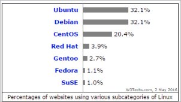
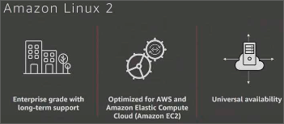
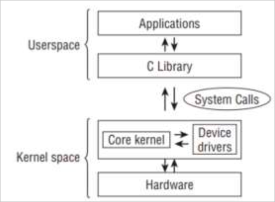
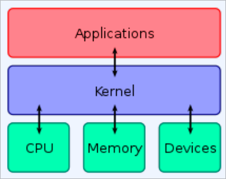
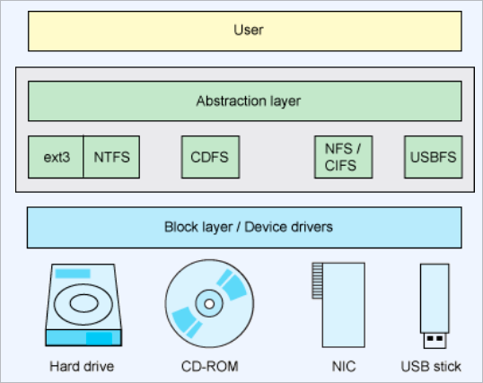
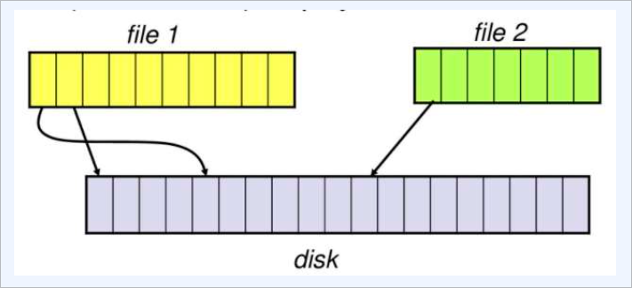
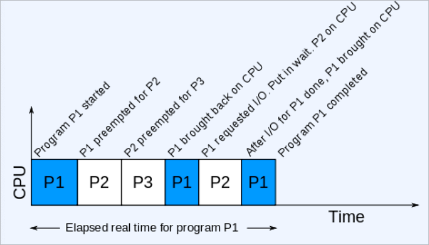
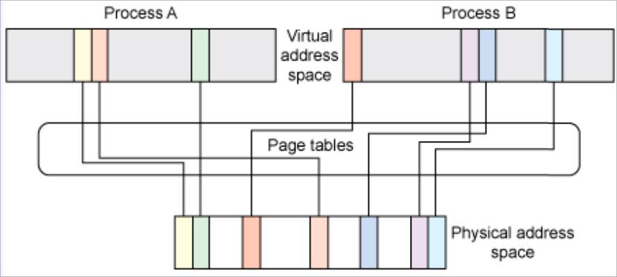
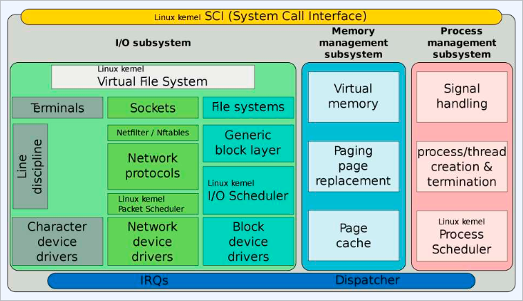
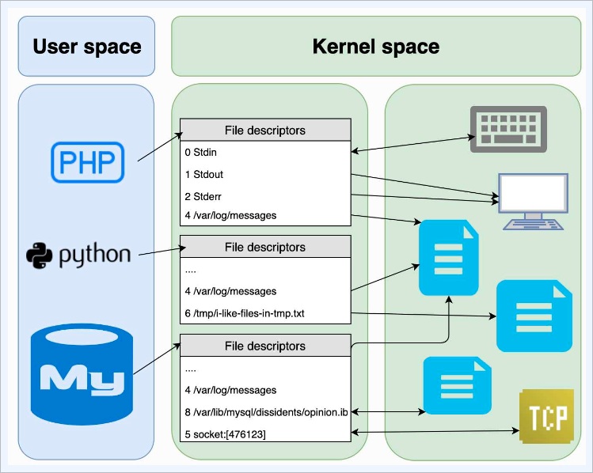

# 컨테이너를 구성하는 리눅스 기술

## 리눅스 배포판

- 전 세계적으로 약 300여 가지의 선택지(리눅스 배포판)존재
  - 3개 주요 리눅스 계열로 정리됨
- Public Cloud 상에도 많은 배포판을 제공

### Debian 계열

- Debian, Ubuntu, Mint Linux 등
- 오픈소스이고 안정성에 초점
- Ubuntu
  - 사용성과 Long Term Support(LTS)을 목표(5년)
  - 다수의 소프트웨어 리포지토리에서 패키지 사용 가능, DPKG 기반, apt-get/apt
  - 서버와 데스크톱에서 널리 사용

### Red Hat / Fedora 계열

- Fedora, Red Hat Enterprise Linux, CentOS, Oracle Linux, Amazon Linux 등
- Fedora는 6개월마다 새로운 버전, CentOS는 좀 더 긴 릴리즈 사이클
- RHEL (Red Hat Enterprise Linux)
  - RPM 기반, yum or dnf 사용
  - 엔터프라이즈 서버 환경을 타겟
  - 긴 릴리즈 사이클 (10년)

### openSUSE 계열

- openSUSE, SUSE Linux Enterprise Server
- 오픈소스이고 안정성에 초점
- SLES (SUSE Linux Enterprise Server)
  - rpm 기반, zypper
  - 관리 목적으로 YaST 사용 가능
  - 안전한 패키지 관리

### 배포판 선택 기준

- 워크로드에 따라 적합한 배포판을 선택
- ex) 웹 서비스
  
- ex) SAP 워크로드
  - SUSE
- 엔터프라이즈
  - Red hat
  - SUSE
  - Amazon Linux 2
    

### 리눅스 커널

- 모놀리식 커널
  - 커널 문맥에서 대부분의 OS 코드를 처리
  - 자원 효율적이지만, 특정 커널 코드의 에러로 인한 영향이 커널 전체에 영향을 줌 (커널 패닉)
- 마이크로 커널
- 하이브리드 커널
  - 하이브리드 커널은 모놀리식 커널과 마이크로 커널의 장점을 결합한 형태로,
    일부 기능을 마이크로 커널화 하여 안정성과 확장성을 높이고 있다.

## 리눅스 커널

- 오픈 소스 모놀리식 유닉스 계열 컴퓨터 운영체제 커널
- 1991년 리누스 토발즈가 자신의 개인용 컴퓨터를 위해 개발
- 크로스 플랫폼의 의도는 없었으나 그 이후로 다른 운영체제나 커널 대비 더 다양한 아키텍쳐를 지원하도록 확장
- C언어, 어셈블러로 작성
- 가장 큰 오픈소스 프로젝트 중 하나로 1200개 이상의 회사의 12000명에 가까운 개발자

### 커널

- 컴퓨터 운영체제의 핵심이 되는 컴퓨터 프로그램 (시스템의 모든 것을 완전히 통제)
- 운영체제의 다른 부분 및 응용 프로그램 수행에 필요한 여러가지 서비스를 제공



```bash
$ cat /etc/passwd
$ strace cat /etc/passwd
```



커널은 어플리케이션 소프트웨어와 하드웨어를 연결한다.

### 리눅스 커널의 주요 기능

- `하드웨어 관리 및 추상화`
  - 디바이스 드라이버만이 하드웨어가 제공하는 기능이나 프로토콜에 관여
  - 사용자 프로그램은 하드웨어에 종속적인 작업이 필요하지 않음
- example
  - 파일 저장 매체 종류를 고려하지 않고 사용 가능 → 블록 I/O 레이어
    
  - 실제 파일이 저장된 위치를 고려하지 않고 사용 가능 → 파일 시스템
    - 어플리케이션에서는 연속된 위치에 저장된 파일 (논리적 관점)
    - 실제 디스크에는 효율적인 위치로 불연속적인 위치에 저장 (물리적 관점)
    - 물리적으로 떨어진 위치의 파일을 논리적으로 연속적인 위치로 제공하는 것이 바로 파일 시스템
      
- `프로세스와 쓰레드 관리`
  - CPU 타임 공유와 메모리 보호
- example
  - CPU 코어 갯수보다 더 많은 수의 프로그램을 동시 실행 가능 → 프로세스 스케줄러
    
  - 운영체제에서 실행하고 있는 프로세스가 자신에게 할당되지 않은 영역의 메모리에 접근하는 것을 차단
    - 예) ASLR(Address Space Layout Randomization)
    - 메모리 주소 정보를 이용한 악의적 공격을 차단
- `메모리 관리`
  - 개별 프로세스에 가상의 연속된 메모리 공간을 제공
    - 32bit 머신: 4GB 64bit 머신: 16 엑사바이트
  - 실제로는 물리 메모리 내에서 같이 섞여서 할당되고 해제됨
    
- I/O 관리
  - 디바이스 드라이버 위에 다양한 I/O를 지원
  - “모든 것은 파일이다”
    
    하부 시스템 구성에 상관없이 파일 입출력 형식으로 제어 가능 → VFS (Virtual File System)
  - 실제로는 유저 영역과 커널 영역이 파일 디스크립터를 이용해서 연결됨
    
