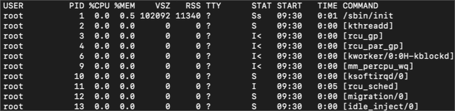
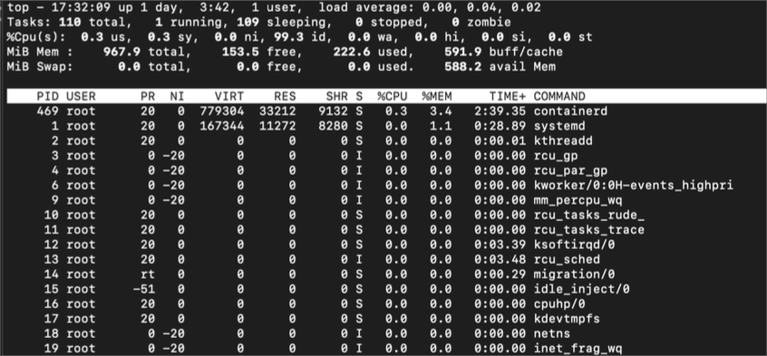
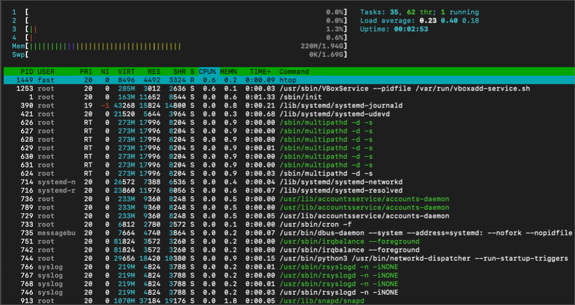
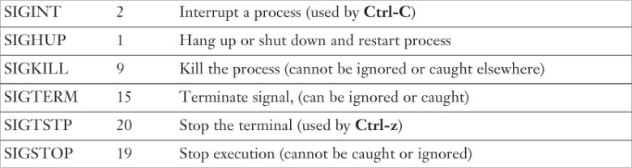

# 프로세스 라이프 사이클의 이해

## 프로세스 생성

### 신규 프로세스 생성

1. fork 시스템 콜로 자신을 복제
   - fork는 두 개의 서로 다른 값을 반환 (자신과 자식을 구별)
   - 자식
     - 0을 리턴
   - 부모
     - 새로 생성된 자식의 PID를 리턴
2. 자식은 새 프로그램의 실행을 위해 exec 계열의 함수를 호출
   - 현재 실행하고 있는 프로그램을 다른 것으로 교체


### 자식 프로세스 종료

- wait 계열 시스템 콜을 호출한 후에만 프로세스 상태정보(프로세스 디스크립터)를 삭제 할 수 있음
  - 부모가 자식 프로세스의 종료 결과를 확인할 수 있도록 설계됨
- 부모가 자식보다 먼저 죽는 경우, 커널은 예정된 wait가 없다는 것을 인지
  - 고아 프로세스를 init process(systemd)의 자식으로 설정
  - 자식 프로세스 종료를 위해 필요한 wait 동작을 수행

### 프로세스 상태

- TASK_RUNNING
  - 프로세스가 실행 가능한 상태
  - 현재 실행 중 또는 실행큐(runqueue)에 실행 대기 상태
- TASK_INTERRUPTIBLE
  - 특정 조건을 기다리며 프로세스가 대기(sleep)또는 중단(block)되어 있는 상태
  - 기다리는 조건이 발생 또는 시그널을 받으면 실행가능 상태로 이동
- TASK_UNINTERRUPTIBLE
  - TASK_INTERRUPTIBLE 상태와 동일하지만, 시그널을 받아도 깨어나지 않음
  - 사용 사례) 프로세스가 다른 방해를 받지 않고 반드시 대기해야 하는 경우로 예를 들면 세마포어를 잡고 중요한 동작을 하는 경우 등
- TASK_ZOMBIE
  - 프로세스가 중단된 상태
  - 부모 프로세스가 wait 시스템 콜을 호출하지 않은 상태


## 프로세스 상태 모니터링

### ps 명령을 사용한 프로세스 모니터링

- 프로세스와 관련된 주요 지표들을 표시
- 버전마다 표시되는 정보에 차이가 있음
- 표시 정보
  - PID, UID, 우선순위, 컨트롤 터미널
  - 프로세스별 메모리 크기, 소비한 CPU 시간, 현재 상태 (실행중/중지/대기 등)



- 주요 명령

  ```bash
  $ ps aux   # 실행중인 모든 프로세스에 대한 정보를 표시
  # a 모든 프로세스
  # u 사용자 지향적 출력
  # x 터미널이 없는 프로세스도 표시
  ```

  - TTY: 컨트롤 터미널 ID
  - STAT
    - R: 실행 가능
    - D: 인터럽트 불가능한 수면 상태 (보통 IO)
    - T: 추적 또는 중지
    - S: 인터럽트 가능한 수면 상태
    - Z: 좀비
    - s: 세션 리더
    - I: 아이들 상태의 커널 쓰레드
    - I: 멀티 쓰레드

  ```bash
  $ px lax   # 실행중인 모든 프로세스 정보를 표시
  # UID를 사용자명으로 변환하지 않고 ID로 표시, 좀 더 가볍게 동작 (교착상태시 효율적)
  # l: long 형태로 표시

  $ ps aux | grep sshd
  $ ps aux | grep -v grep | grep sshd
  # 특정 명령에 대한 process 정보를 확인

  $ ps auxf
  # 자식 프로세스를 트리 형태로 표시
  ```

### top 명령을 사용한 프로세스 모니터링

- 3초(기본값)동안 수집한 리눅스 프로세스 정보를 지속적으로 제공하는 도구
- 가장 CPU를 많이 사용하는 프로세스를 화면의 맨 위에 배치
- 화면 상단에는 시스템 상태의 요약 정보를 제공
- htop은 좀 더 나은 인터페이스를 제공 (스크롤, full 커맨드 라인 정보 제공)





### 프로세스 종료

- 주로 kill 명령을 통해 프로세스 종료 관련 시그널을 전송
  ```bash
  kill [-signal] pid
  ```

### 주요 시그널

- SIGTERM [15]
  - 실행을 완전하게 종결하라는 요청
  - 프로세스가 시그널 수신 (처리/차단) 가능
- SIGKILL [9]
  - 차단 불가능하며, 프로세스를 커널 수준에서 종료
  - 프로세스가 시그널을 수신할 수 없음
- SIGINT [2]
  - 터미널에서 ctrl+c 입력시 전송
  - 프로세스가 시그널 수신 (처리/차단) 가능



### 권장하는 프로세스 종료 방식

- `kill -15`로 종료해본 뒤, `kill -9`을 시도하는 것을 권장
- `kill -9`로도 안되는 경우가 있다?
