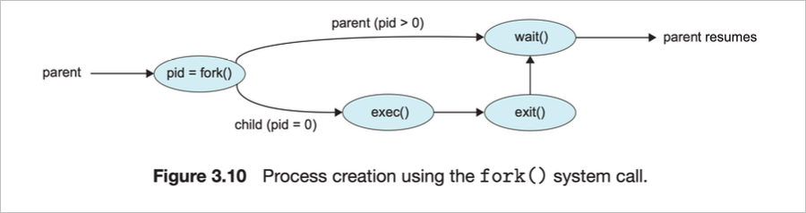
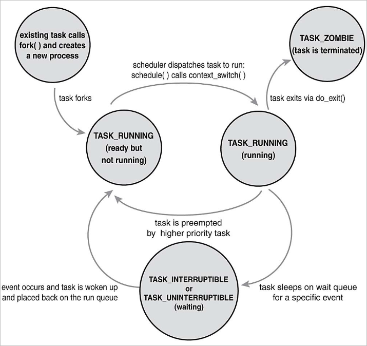

# 프로세스 라이프 사이클의 이해

## 프로세스 생성

### 신규 프로세스 생성

1. fork 시스템 콜로 자신을 복제
   - fork는 두 개의 서로 다른 값을 반환 (자신과 자식을 구별)
   - 자식
     - 0을 리턴
   - 부모
     - 새로 생성된 자식의 PID를 리턴
2. 자식은 새 프로그램의 실행을 위해 exec 계열의 함수를 호출
   - 현재 실행하고 있는 프로그램을 다른 것으로 교체

### 자식 프로세스 종료

- wait 계열 시스템 콜을 호출한 후에만 프로세스 상태정보(프로세스 디스크립터)를 삭제 할 수 있음
  - 부모가 자식 프로세스의 종료 결과를 확인할 수 있도록 설계됨
- 부모가 자식보다 먼저 죽는 경우, 커널은 예정된 wait가 없다는 것을 인지
  - 고아 프로세스를 init process(systemd)의 자식으로 설정
  - 자식 프로세스 종료를 위해 필요한 wait 동작을 수행

### 프로세스 상태

- TASK_RUNNING
  - 프로세스가 실행 가능한 상태
  - 현재 실행 중 또는 실행큐(runqueue)에 실행 대기 상태
- TASK_INTERRUPTIBLE
  - 특정 조건을 기다리며 프로세스가 대기(sleep)또는 중단(block)되어 있는 상태
  - 기다리는 조건이 발생 또는 시그널을 받으면 실행가능 상태로 이동
- TASK_UNINTERRUPTIBLE
  - TASK_INTERRUPTIBLE 상태와 동일하지만, 시그널을 받아도 깨어나지 않음
  - 사용 사례) 프로세스가 다른 방해를 받지 않고 반드시 대기해야 하는 경우로 예를 들면 세마포어를 잡고 중요한 동작을 하는 경우 등
- TASK_ZOMBIE
  - 프로세스가 중단된 상태
  - 부모 프로세스가 wait 시스템 콜을 호출하지 않은 상태

