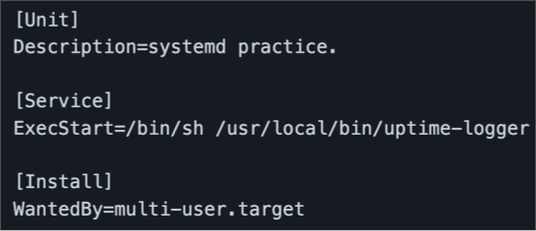
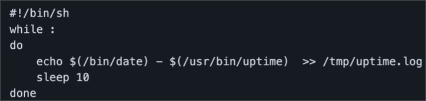

# 시스템 부팅 시 자동 실행되는 서비스 만들기

## 시스템 부팅 시 자동 실행되는 서비스 만들기

[linux_campus/systemd_test.md at main · go4real/linux_campus](https://github.com/go4real/linux_campus/blob/main/Part3/Ch01_05/systemd_test.md)

### 커스텀 스크립트

- 시스템 구동 정보를 로그 파일에 기록
  
  `/etc/systemd/system/uptime-logger.service`
  
  `/usr/local/bin/uptime-logger`

### 서비스 목록 리로드

```bash
sudo systemctl daemon-reload
```

### 서비스 구동 및 시작 목록에 추가

```bash
sudo systemctl start uptime-logger.service
sudo systemctl enable uptime-logger.service
```

### 시스템 재시작 서비스 상태 확인

```bash
sudo systemctl status uptime-logger.service
```

### 서비스 제거

- 설치의 역순으로 진행

```bash
sudo systemctl disable uptime-logger.service
sudo systemctl stop uptime-logger.service
sudo rm /etc/systemd/system/uptime-logger.service
sudo rm /tmp/uptime.log
sudo systemctl daemon-reload
```
