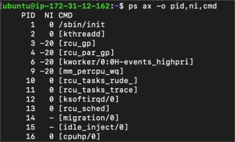

# 프로세스 구성요소의 이해

## 프로세스, 쓰레드

### 프로세스의 정의

- 실행중인 프로그램
- 프로그램 진행 상태를 완전하게 나타내는 자료구조의 집합 (프로세스 디스크립터)
  (실행중인 프로그램 코드, 열린 파일, 지연된 시그널 리소스, 내부 커널 데이터, 프로세서 상태, 주소 공간 등
  
  

### 쓰레드의 정의

- 프로세스 내의 실행 흐름 (프로세스당 최소 1개 이상의 쓰레드가 존재)
- 리눅스에서는 경량 프로세스(lightweight process)라고도 부름
  - 쓰레드 단위로 스케줄링 (컨텍스트 스위칭)
- 쓰레드는 주소 공간이나 열린 파일 등에서 여러 자원을 공유할 수 있음
  - 공유자원을 접근할 때 서로 동기화 해야 함
    
- 리눅스 커널 입장에서는 동일하게 취급

### PID

- 커널은 각 프로세스에 고유한 ID를 부여 (Process ID)
- PID는 프로세스가 생성되는 순서대로 배정

### PPID (Parent Process ID)

- 리눅스에는 새 프로그램을 시작하는 시스템 콜이 없음
- 기존 프로세스를 복제 및 프로그램을 교체하는 방식
  - 기존 프로세스는 새로운 프로세스를 생성하고 자신을 복제 함
  - 복제된 프로세스는 현재 실행중인 프로그램을 교체
- PPID는 그 프로세스를 복제한 부모의 PID
  

### Niceness

- 프로세스 스케줄링의 우선순위를 결정
- 우선순위 높음 = CPU 사용 시간이 많음
- Nice 값의 범위: -20 ~ +19 (작을수록 불친절 = 양보하지 않음 = 우선순위 높음)
- 조정
  ```bash
  $ nice n 5 [command]
  $ sudo renice -5 -p [process id]
  $ sudo renice 5 -u [username or UID]
  ```
- 수작업으로 우선순위를 조정하는 경우는 흔치 않음
  - 근래 CPU 성능개선, 스케줄러, I/O 요청 등의 영향으로 조정에 따른 차이가 극적이지 않음
  - 대부분의 경우 기본값 사용
    

## 정리

### 프로세스

- 실행중인 프로그램

### 쓰레드

- 프로세스 내의 실행 흐름
- 리눅스의 쓰레드는 경량화된 프로세스 개념
  - 쓰레드 단위로 스케줄링

### PID, PPID

- 부모 프로세스를 복제 및 교체하는 방식으로 프로세스 생성

### Niceness

- 프로세스 스케줄링의 우선순위를 결정
  - -20~+19 (작을수록 불친절 = 양보하지 않음 = 우선순위 높음)
  - 대부분 기본값 사용
