# 컨테이너 기반 가상화 소개

## VM과 컨테이너 비교

### 가상 머신 (Virtual Machine)

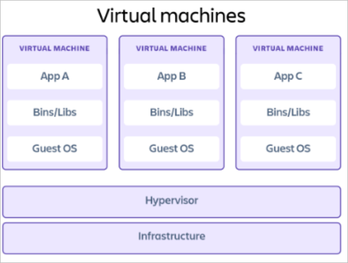

- 저수준 하드웨어 장치 (CPU, Disk, Network)를 가상화

### 장점

- 같은 서버(호스트OS)에 다양한 운영체제를 실행
- 물리머신 대비 동일한 자원을 더 효율적으로 사용
- 물리 머신 대비 빠른 서버 프로비저닝

### 단점

- OS 이미지, 라이브러리, 어플리케이션을 반복적으로 포함 (중복 설치 문제)

### 컨테이너 (Container)

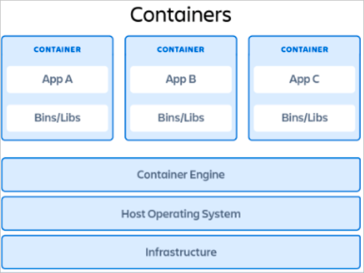

- 어플리케이션 구동에 필요한 모든 종속성을 포함한 소프트웨어 패키지를 운영체제 위에서 가상화

### 장점

- 컨테이너를 어느 환경에나 배포 가능
- OS를 부팅하거나 라이브러리를 로드할 필요가 없음
- 가상 환경을 더 효율적이고 경량으로 생성 가능
- 수초 이내의 빠른 시작 시간
- 하나의 호스트에 더 많은 어플리케이션 실행 가능
- OS 패치 업데이트 등 유지 관리와 관련된 오버헤드 감소

### 단점

- 컨테이너가 정의된 운영체제에 종속성을 가짐

## 다중 운영체제 지원

- Docker에 다중 운영체제 사용이 가능할까?

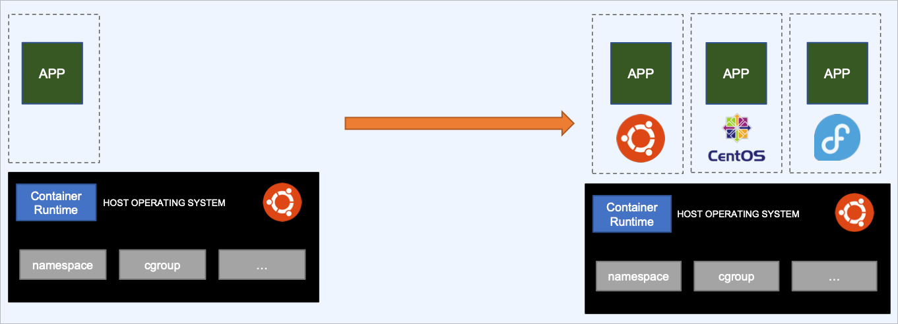

- Docker Hub에 다양한 리눅스 배포판이 존재

```bash
$ cat /etc/os-release
NAME="Ubuntu"
...

$ docker pull fedora
$ docker run --rm fedora cat /etc/os-release
NAME="Fedora Linux"
...
```

- ‘Docker는 OS레벨 가상화 기술’ from Wiki
- OS 레벨 가상화란?
  - 커널이 여러 격리된 사용자 공간 인스턴스의 존재를 허용하는 운영체제의 패러다임
  - containers: LXC, Solaris containers, Docker, Podman
    zones: Solaris containers
    virtual kernels: DragonFly BSD
    jails: FreeBSD jail, chroot jail
  - 호스트 OS의 커널!을 공유
    ```bash
    $ uname -a
    > Linux 5.4.0-104-generic ~~
    $ docker run --rm fedora uname -a
    > Linux 5.4.0-104-generic ~~
    ```
- 리눅스와 리눅스 패포판의 차이
  - Ubuntu, Redhat, SUSE, CentOS (리눅스 패포판)
  - 리눅스 배포판 = 리눅스 커널 + 컴포넌트 (e.g. 윈도우 시스템, 데스크톱 환경, 서비스 데몬, 패키지 매니저, 어플리케이션 등)
- 리눅스와 리눅스 커널의 차이
  - 리눅스 커널: 하드웨어 자원을 관리하고 추상화하여 프로세스에게 할당하고 관리하는 역할을 수행

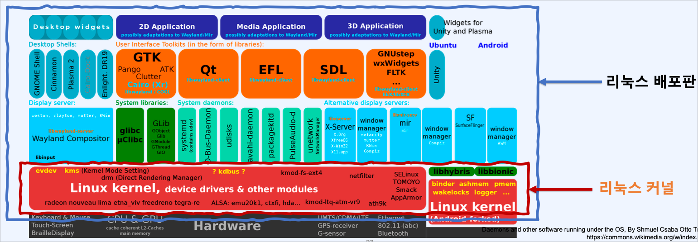

- 예를 들어, Ubuntu 호스트 Docker에 Amazon 리눅스 배포판을 실행
  - 리눅스 커널 + 컴포넌트 (e.g. ~~윈도우 시스템, 데스크톱 환경, 서비스 데몬~~, 패키지 매니저, 어플리케이션 등)
    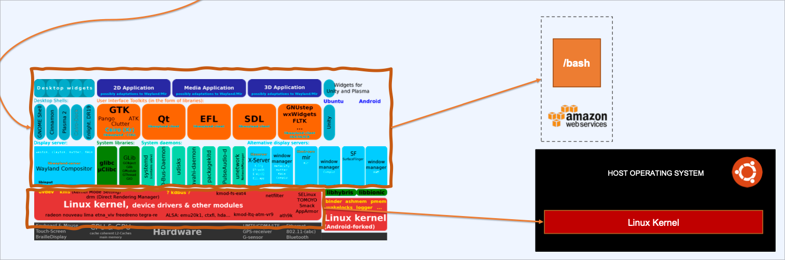
- 리눅스 도커에 윈도우 컨테이너를 올릴 수 있을까?
  - 불가, 커널을 공유하는 구조로는 윈도우를 리눅스 커널에 올릴 수 없음
- 그럼 윈도우나 맥호스트에 우분투 컨테이너가 동작하는가?
  - 가능, 단, 가상화 환경 (LinuxKit) 위에서 동작하기 때문에, 리눅스 컨테이너는 리눅스에서 동작시키는 것이 바람직하다.

## 컨테이너 관련 에코/용어 정리

### CNCF (Cloud Native Computing Foundation)

- 벤더 중립적인 클라우드향 오픈소스 프로젝트를 관리하는 재단
- 대표 프로젝트로 쿠버네티스, HELM, CoreDNS, etcd, fluentd, containerd, Prometheus 등
- 클라우드 네이티브
  - 퍼블릭/프라이빗/하이브리드 클라우드 환경에서 확장 가능한 형태로 빠르고 민첩하게 어플리케이션을 빌드하고 실행하는 것을 목표로 함
  - 뒷받침하는 기술로 컨테이너, 마이크로서비스, 서비스 메시, 변경 불가능한 인프라 등
- CNCF에 등록된 프로젝트들은 100개 이상 있고, + 벤더 기술까지 포함하면 많은 기술들이 존재함
  - 너무 많은 툴이 있어서 개별적으로 전부 알아보는 것은 불가
  - 문제나 프로세스에 대한 이해와 더불어 적합한 툴을 찾는것을 목표로 할것

## Cloud Native Trail Map

1. Containerization
2. CI/CD
   1. Argo
3. Orchestration
   1. Kubernetes
4. Observability
   1. Prometheus, Fluentd
5. Service proxy, discovery, mesh
   1. envoy, CoreDNS
6. Networking, Security
   1. CNI (Calico, Flannel, Weave Net, Cilium)
7. Database & Storage
   1. etcd
8. Streaming & Messaging
   1. gRPC (http/2 base, protobuf), cloudevents
9. Container registry & Runtime
   1. containerd
10. Software distribution

## 컨테이너 런타임 표준

### OCI (Open Container Initiative)

- OCI (Open Container Initiative)는 컨테이너 포맷과 런타임을 표준화 하는 업계 표준 기구이다. OCI는 Docker, CoreOS, Google, Amazon 등 다양한 기업들이 참여하여 컨테이너 기술의 호환성과 이식성을 높이기 위해 설립되었다.

  1. OCI 설립 이전의 형태

     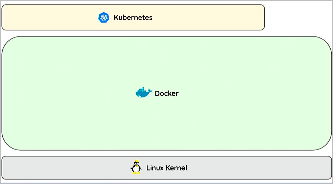

     - 리눅스 커널에서 도커가 쿠버네티스 사이에 모든 처리를 담당하는 형태

  2. 다양한 런타임이 등장하며 쿠버네티스의 인터페이스가 세분화되고 그에 따른 표준화 필요성 대두

     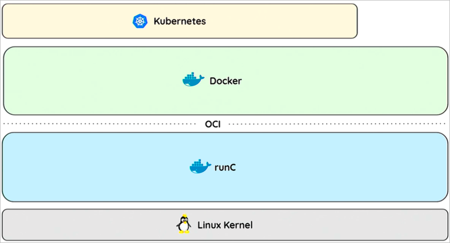

     - 이에 대한 솔루션으로 컨테이너의 런타임 표준을 구성
     - OCI(Open Container Initiative)가 등장하여 컨테이너 형식(format)과 런타임(runtime)의 표준을 구성 (Docker, IBM, CoreOS, Google, MS, …)
     - 현재 대부분의 컨테이너 런타임은 이 형식을 따름
     - OCI 런타임
       - 컨테이너 실행에 필요한 저수준 컨테이너의 런타임을 지칭
       - CGroups, namespace, security 등의 기본적인 실행 환경
       - runc는 OCI 기준 스펙에 따라 컨테이너를 생성 및 실행하기 위한 CLI 툴

### CRI (Container Runtime Interface)

- CRI (Container Runtime Interface)는 쿠버네티스와 컨테이너 런타임 사이의 표준 인터페이스를 정의한다. CRI는 쿠버네티스가 다양한 컨테이너 런타임을 지원할 수 있도록 하는데 도움이 된다. CRI에는 RuntimeService와 ImageService 두 가지 API가 있다. RuntimeService는 컨테이너 라이프사이클을 관리하고, ImageService는 컨테이너 이미지를 관리한다.

  1. OCI를 이용한 다양한 컨테이너 런타임이 등장하며 쿠버네티스에서 해당 런타임들을 지원하기 위해 인터페이스들을 만들어야 했음

     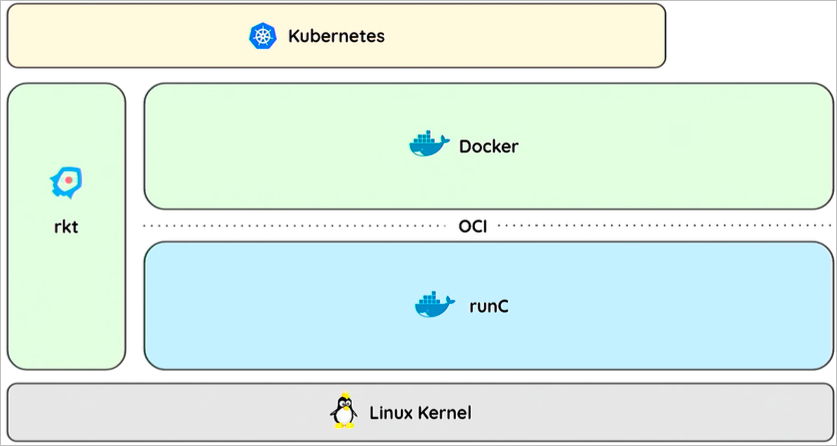

  2. 이에 따라서 고수준의 컨테이너 런타임 표준을 만들 필요가 생김

     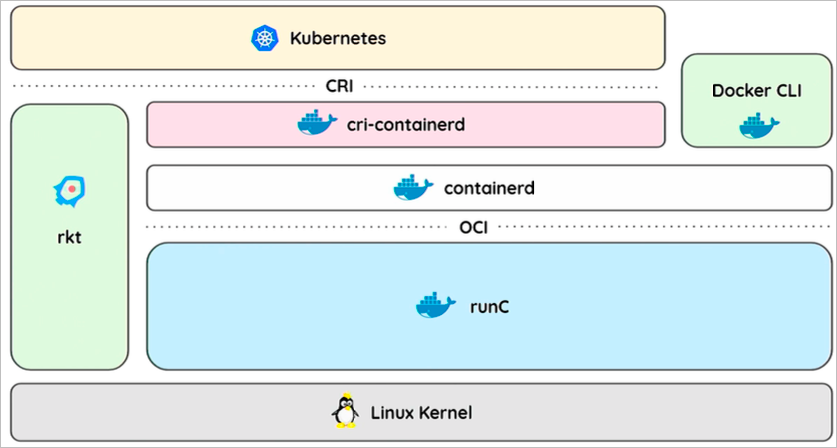

     - CRI(Container Runtime Interface)는 쿠버네티스에서 다양한 컨테이너 런타임을 사용할 수 있도록 하는 플러그인의 인터페이스
     - 현재 대부분의 컨테이너 런타임이 이 형식을 따름
     - CRI runtime은 컨테이너 라이프사이클과 이미지 등을 관리
     - 쿠버네티스에서 지원하는 컨테이너 런타임 종료로 containerd, CRI-O, Mirantis Container Runtime, Docker Engine 등이 존재

## OCI, CRI Security

- 컨테이너의 근본적인 기술인 리눅스 커널을 공유하는데서 오는 보안상의 문제
  - 어플리케이션의 악의적, 의도치 않은 취약점으로 인해 리눅스 커널이 영향을 받는 경우, 공유된 다른 어플리케이션 및 서비스가 영향을 받을 가능성이 존재
    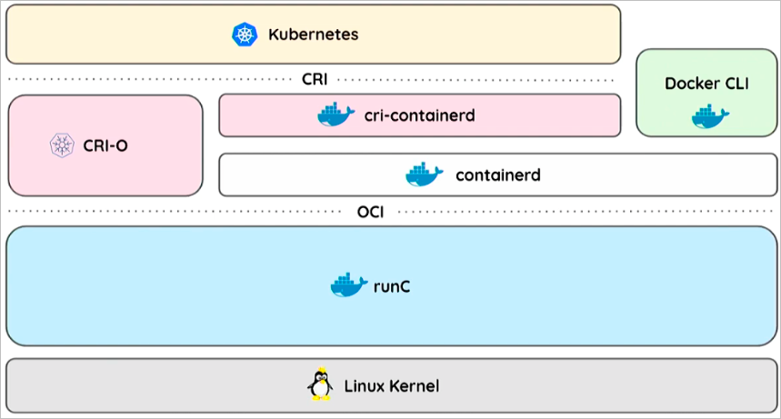
- 하지만 그렇다고 리눅스 커널에 기존의 하이퍼바이저를 통한 게스트OS 설치를 하는 것은 회귀가 되버리기 때문에, 경량 VM을 이용하여 컨테이너 런타임을 구성하고자 함
  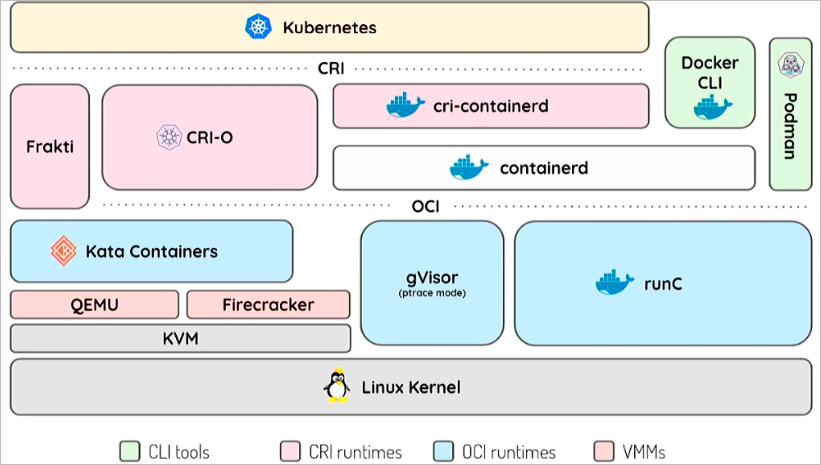
  - Firecracker
    - AWS에서 개발한 경량 microVM(마이크로 가상머신)을 위한 VMM
    - 보안, 고성능, 운영환경 적용, 낮은 오버헤드, 오픈소스
  - Kata Containers
    - 쿠버네티스에서 다양한 런타임을 사용할 수 있도록 하는 플러그인 인터페이스
  - 컨테이너의 보안을 위해 Firecracker와 Kata Containers와 같은 경량 가상머신을 이용하여 컨테이너 런타임을 구성하는 것이 좋다. 이러한 마이크로 VM 기반의 컨테이너 런타임은 컨테이너의 고유한 커널을 갖기 때문에 공유된 리눅스 커널이 악성 코드에 노출될 가능성을 낮출 수 있다.
    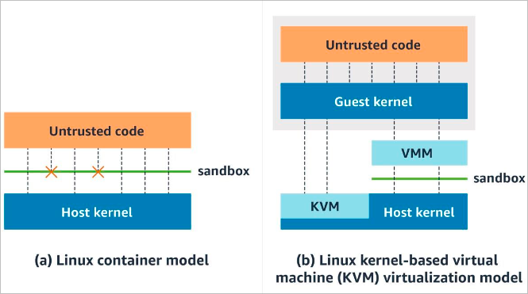
    QEMU를 경량화하도록 수정 (96% 코드 감소)
