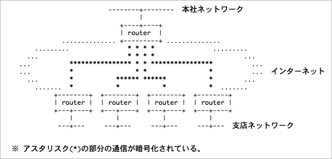
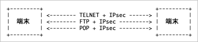

# IPSec 개요

## IPSec의 역할

- IPSec은 IP Security Architecture의 약어로 인터넷에서 안전한 통신을 실현하기 위해 제안된 방식의 하나
- 인터넷에서 안전한 통신을 실현하기 위해서는 여러가지 방법이 존재하며, 예를 들면 S/MIME이나 PGP는 메일 통신을 보호하고 SSL은 웹 통신을 보호하는 것처럼, IPsec은 특정 어플리케이션이 아닌 다양한 어플리케이션을 보호하는 특징을 가지고 있음
- 본래 인터넷을 경유하는 통신은 도청이나 변조등 다양한 위협에 노출되어 있지만 암호를 통해 통신이 보호되면 이러한 위협을 완화하는 것이 가능함
- 안전하지 않은 통신로를 사용하여 암호를 통해 안전성을 높이는 네트워크를 VPN(Virtual Private Network)라고 부름 그리고 IPSec은 VPN을 구축하기 위한 도구로서 널리 이용되고 있음 다음의 구성도는 전형적인 VPN의 구성예임

- VPN의 구성에서는 단말이 통신을 암호화할 필요는 없기 때문에 암호화를 위한 소프트웨어는 필요하지 않은 반면에 라우터는 LAN에서 WAN으로의 통신을 암호화하여 WAN에서 수신하는 통신의 복호화 하는 기능을 가짐
- IPSec에서는 이러한 기능을 가지는 라우터를 보안 게이트웨이(Security Gateway)라고 부름
- IPSec은 VPN을 실현하는 도구로서 널리 이용되지만 VPN만이 IPSec의 용도는 아니며 아래의 구성도처럼 단말과 단말 사이에서 통신을 하는 경우도 있음

- 위와 같은 사용방법은 트랜스포트 모드라고 알려진 모드인데, 실제로는 많이 사용되지는 않고 있는데, 그 이유로는 어플리케이션마다 트랜스포트 모드의 제어를 해야할 필요가 있어 설정의 수고가 너무 많기 때문이고, SSH와 같은 용도를 제한한 어플리케이션이 널리 보급되어 있기 때문에 설정의 어려움을 가진 트랜스포트 모드를 보급하기 어렵기 때문일수도 있음
