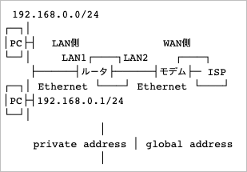

# PPPoE

## 개요

- BRI등의 회선 인터페이스 경유로 LAN간 접속을 하는 경우 Point-to-Point Protocol (PPP, RFC1661)이 이용됨
  - PPP를 이더넷상에서 실현하는 것이 PPP over Ethernet(이하 PPPoE, RFC2516)
  - 이더넷을 통해 ISP에 접속하는데 사용됨
  - 후렛츠, ADSL을 이용하는 경우 PPPoE를 이용해서 ISP에 접속하게 됨
- RT에 PPPoE 설정을 하면 엑세스 컨센트레이터와의 대응 IP 패킷의 캡슐화는 RT에서 수행함
  - 랜측에서는 PPPoE 설정을 수행할 필요가 없어짐
- RT에 설정하는 config은 PP에 대해서 설정하게 됨
- PPPoE를 이용하는 랜 인터페이스의 명시 커맨드 (pppoe use)등 종래의 PP에 대한 설정과 기본적으로는 동일
- 단, MP와 압축기능은 사용 불가능함
- 또한 패킷 사이즈의 네고시에이션에 대한 설정이 필요
- connect/disconnect 커맨드에 의한 수동접속/절단도 가능
- 절단 타이머는 디폴트로는 무효로 되어있고, 한번 접속하면 자동으로 절단은 하지 않음
- 절단이 필요한 경우는 pppoe disconnect time 또는 pppoe auto disconnect를 설정해야 함
- 설정에 따라서는 PPPoE 패킷을 랜측에 송신하는 것도 가능하지만 그 경우에는 랜측과 WAN측이 동일 물리 세그먼트가 되어 WAN측에서 LAN측의 패킷을 관찰할수 없게 되므로 보안상 문제가 발생할 가능성이 있음
- 구현된 PPPoE기능은 클라이언트로서 동작하므로, 서버에 대해서 접속은 가능하지만 서버로서의 기능은 불가능함

## 설정의 포인트

- 패킷사이즈
- PPP를 이용하는 경우 LCP에서 MRU(Maximum-Receive-Unit)옵션을 이용하여 패킷 사이즈의 네고시에이션이 됨
- RT에서 기본값으로 MRU옵션은 1792옥텟으로 네고시에이션을 수행
- BRI등의 회선 인터페이스를 이용하는 경우는 이 기본값 설정에 문제가 없지만, PPPoE로서 이더넷상의 PPP를 사용하는 경우에는 문제가 됨
- 이더넷 프레임중 디폴트가 최대 1500 옥텟으로 설정되어 있기 때문인데, 이 사이즈보다 큰 패킷이 발생하면 송신상의 전송분할(프레그먼트)이 발생하여 스루풋 저하등의 통신이상이 발생할 수 있음
- 그렇기 때문에 RT에서는 ppp lcp mru 명령어를 통해 네고시에이션을 수행하는 MRU옵션의 값 (패킷사이즈)를 제한할 필요가 있음
  - 예를 들어 ADSL에서는 MRU 옵션은 1454 옥텟으로 설정할 필요가 있기 때문에 ppp lcp mru on 1454가 됨
- 설정해야 할 값을 알지 못하는 경우에는 1492 (RFC2516에서 규정되어 있는 PPPoE의 MRU 최대치)이하의 값을 설정해야 함
  - 통신에 이상이 있는 경우 이 값을 작게 설정하면 증상이 개선될 수 있음
- 또한 RT에서 MTU (Maximum Transfer Unit)에 대해서는 접속처에서 통지되는 MRU옵션의 네고시에이션 결과를 반영하게 됨
- 접속처에서 MRU가 통지되지 않는 경우에는 ip pp mtu 명령을 통해 명시해야 할 필요가 있음. 이 경우에는 ppp lcp mru 에서 설정한 동일한 값을 설정
- 통신에 사용할 PC의 OS측에서 검출된 패킷사이즈를 조정하는 것으로 스루풋을 향상시킬 수 있는 것으로 보임 상세한 내용은 OS 메이커에 문의하거나 유저 정보교환으로 해결하자
- MP란?
  - PPP Multilink Protocol RFC1990
- 압축이란?
  - PPP Compression Control Protocol (CCP) RFC1962
- CHAP/PAP인증, IPCP에 의한 아이피 주소나 DNS주소의 취득 또는 NAT/IP마스커레이드에 대해서는 종래의 PP설정과 동일

## 설정 예시

### 패턴1 IP마스커레이드 기능을 이용한 PPPoE접속



- LAN1을 이용하여 내부 통신, LAN2를 이용하여 외부 통신
- 내부측 복수 호스트에서 동시접속 가능하기 떄문에 외부측에 대한 IP 마스커레이드를 이용
- IP 마스커레이드 (IP Masquerade) ?
  - 리눅스의 NAT 기능으로 내부 컴퓨터들이 서버를 통해 인터넷 등 다른 네트워크에 접속할 수 있도록 하는 기능
  - 내부 컴퓨터들이 생성한 모든 네트워크 요청들이 MASQ를 통해서 서버의 외부 공인 IP로 변환되어 인터넷에 연결됨, 따라서 외부에서는 서버측의 IP만 인지 가능하고 내부 호스트의 존재를 알 수 없음
  - 보안이 높다는 것이 장점이지만, 외부에서 접근이 불가능한것이 단점임
  - 외부에서 내부로의 접속이 필요한 경우 특정 포트를 내부의 호스트와 연결하는 포트포워딩 기술이 적용되면 통신 가능해짐
- 내부측에 대한 DHCP 서버로서의 기능 수행
- 외부측 브로드밴드 회선 모뎀등에서 이더넷 회선에 접속함

```bash
# ip lan1 address 192.168.0.1/24
# 내부 lan1 주소 대역을 192.168.0.0/24로 지정하고, 게이트웨이 주소를 .1로 설정

# nat descriptor type 1 masquerade
# pp1에 대한 ip masq를 위한 디스크립터를 설정

# pp select 1
# pp1번을 선택

pppoe use lan2
# lan2에서 pppoe를 사용함을 명시

pp auth accept chap pap
pp auth myname id pass
# PPPoE 서버에 대한 인증정보를 설정함

ppp ipcp ipaddress on
# 접속시 서버에서 아이피 주소를 취득

ppp ipcp msext on
# 이 설정을 통해 서버로부터 DNS서버주소를 얻어오는 것이 가능해짐

ip pp nat descriptor 1
# ip masq기능을 정의해둔 nat 디스크립터를 pp1에 적용

ppp lcp mru on 1454
# LCP 네고시에이션의 Maximum-Receive-Unit 옵션을 이용해서 패킷의 최대값을 제한

ip pp mtu 1454
# 접속처에서 LCP로 MRU 옵션을 제공받으면 필요없음, pp1에 대한 MTU(Maximum-Transfer-Unit)을 설정

ppp ccp type none
# 압축기능을 사용할 수 없지만, 기본적으로 stac압축을 사용하도록 설정되므로 none으로 설정할 필요가 있음

pp enable 1
pp select none
# pp1을 유효로 설정하고 루트로 돌아감

# ip route default gateway pp 1
# 접속이 랜이 아닌것에 대한 모든 연결을 pp1로 보냄

# dns server pp 1
# DNS서버 주소는 pp1에서 취득한 주소로 함

# dns private address spoof on
# 개인 주소의 DNS 주소 확인 요청을 DNS 서버로 전달하지 않도록 설정

# dhcp service server
# dhcp scope 1 192.168.0.2-192.168.0.254/24
# LAN1측의 DHCP 서버 기능 및 주소 범위를 지정

# save
```

```bash
console character en.ascii
# 야마하 라우터의 언어설정을 영어로 변경

connect pp 1
disconnect pp 1
# pp 1 접속 및 접속 해제

pp select 1
pp keepalive interval 30 retry-interval=30 count=12
pp always-on on
pppoe auto disconnect off
# pp 1 자동접속 설정
```
