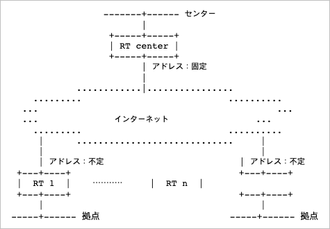
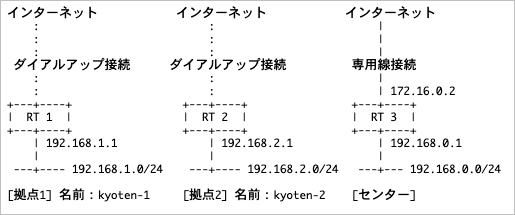

# Dial-Up VPN 설정가이드

## 개요

- 다이얼업 VPN이란 프로바이더가 고정IP를 부여하지 않아서 라우터의 IP주소가 동적으로 변경될 때 VPN을 구축하기 위한 기능
- 다이얼업 VPN의 특징으로는 라우터를 [이름]으로 식별하는 것인데 다이얼업이 아닌 VPN에서는 IP주소를 사용해 상대방 라우터를 식별하지만, 다이얼업 VPN에서는 [이름]을 사용하여 상대방 라우터를 식별하므로 IP주소의 변경에도 라우터를 식별할 수 있게 됨
- 다이얼업 VPN에서는 양쪽 라우터가 [센터]와 [거점]의 역할을 분담하여 동작하는데, 센터 라우터에서는 반드시 고정 글로벌IP를 가지고 거점에서의 접속을 기다려야 하고 거점 라우터는 IP주소가 변경되는 것을 가정함
- 다음 구성도에서 다이얼업 VPN의 전형적인 구성을 나타냄



- 거점에는 각각 이름을 붙일 필요가 있고 센터 라우터에서 각각 이름에 대해서 설정이 필요함

## 제약사항

- 다이얼업 VPN에서 몇가지 제약사항이 존재하므로 파악해둘것
- IP주소가 계속 변경되므로, AH(인증헤더)의 이용이 불가능
- ESP에 대해서는 문제없이 동작하므로 인증이 필요한 경우에는 ESP옵션으로 제공되는 인증 옵션을 이용할것
- 센터 라우터가 재부팅할 경우 센터에서 관리되는 SA가 제거되어 통신이 정지하게 됨 이것은 거점 라우터의 IP주소가 정해져 있지 않기 때문에 센터 라우터가 거점 라우터에 대해 리부팅을 통지하기 어렵기 때문임
- 최근 펌웨어에서는 IKE 킵얼라이브를 사용하는 것으로 이러한 점을 해소할수 있게 되어 있음
- IKE 킵얼라이브는 상대 라우터의 SA가 삭제되었을 경우 그것을 검출하는 메커니즘을 채용하고 있음
- 상호접속성에 제약이 있음 기본적으로 IPSec에 관해서는 RFC에 따르므로 다른 벤더의 기종과 상호 접속 가능할수도 있지만 다이얼업 VPN 상호접속에 대해서는 확인되어 있지 않음

## 설정의 안내

- 다이얼업 VPN의 설정 요건으로 먼저 설정 가이드의 기본적인 구성에 대해서 숙지할 필요가 있음
- 구성은 다음을 상정 왼쪽의 2개가 거점 오른쪽이 센터가 됨



- 구성도에서는 그려지지 않았지만 거점1과 거점2는 각각 센터에 접속하여 VPN을 구성하게 됨
- 거점1과 거점2는 접속하지 않음

## 거점의 설정

- 회선 설정은 생략하고 IPSec 부분에 대해서만 설명하는 것으로 함
- 먼저 라우터의 IP주소에 대해서 설정, 내부측의 주소에 대해서 고정 글로벌IP주소가 없이 LAN쪽 프라이빗 주소를 등록하게 되며, 상대방의 주소는 센터의 고정 IP주소인 172.16.0.2를 등록

```
# ipsec ike local address 1 192.168.1.1
# ipsec ike remote address 1 172.16.0.2
```

- 다음으로 IKE에 대한 항목을 설정

```
# ipsec ike pre-shared-key 1 text password
# ipsec ike local name 1 kyoten-1 [key-id]
```

- 2행의 새로운 명령은 내부 라우터의 이름을 설정하는 명령어로 마지막 key-id 매개변수는 설정하지 않아도 괜찮음
- 여기에 터널 인터페이스의 설정을 더함

```
# ipsec sa policy 101 1 esp des-cbc
# tunnel select 1
# ipsec tunnel 101
# tunnel enable 1
# ip route 192.168.0.0/24 gateway tunnel 1
```
