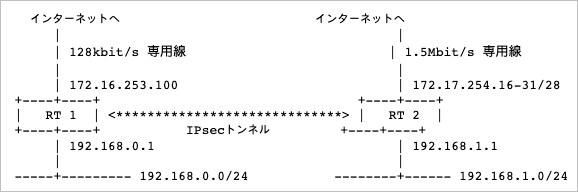

# IPSec 기본 설정가이드

## 소개

- IPSec에 관련된 기본적인 설정을 망라했기 때문에, 상황에 따라 조금씩 변경은 필요하더라도 아래의 기초적인 설정 내용은 바뀌지 않기 때문에 한번은 읽어보는 것을 추천



- 참고: 프로바이더에서 부여받은 글로벌IP를 표현하기 위해 172.16.0.0/12 범위의 IP주소를 사용함
- 참고: Rev.6.02.16 펌웨어 상에서의 설정을 기준으로 설명하고 있기 때문에 그 이전의 명령어에 대해서는 다를 수도 있음
- 이 구성에서 요건은 다음과 같음
  - RT1은 고정 글로벌IP로 172.16.253.100을 가짐
  - RT2는 고정 글로벌IP로 172.17.254.16-31을 가짐
  - 192.168.0.0/24와 192.168.1.0/24의 단말은 인터넷에 접속할 수 있음
  - 192.168.0.0/24와 192.168.1.0/24의 단말은 IPSec로 상호 통신 가능

## 라우터의 IP주소 설정

- 먼저 라우터의 IP주소를 설정해야 하는데, 라우터의 IP주소는 상호간의 라우터를 식별하기 위한 IP주소가 됨
- RT1은 글로벌IP주소가 하나뿐이므로 그것이 라우터의 IP주소가 되지만 RT2는 글로벌IP주소가 복수 있으므로 그 중에서 한가지를 고르게 됨 (172.17.254.30을 선택했다고 가정)
- 자신측의 라우터 IP주소를 설정하기 위해서는 `ipsec ike local address` 명령어를, 상대방측 라우터의 IP주소를 설정하기 위해서는 `ipsec ike remote address` 명령어를 사용함
- RT1 설정
  ```
  # ipsec ike local address 1 172.16.253.100
  # ipsec ike remote address 1 172.17.254.30
  ```
- RT2 설정
  ```
  # ipsec ike local address 1 172.17.254.30
  # ipsec ike remote address 1 172.16.253.100
  ```
- 여기서 1이라는 매개변수는 복수의 VPN을 구성할 때 상대를 구별하기 위해 필요한 식별자 (첫번째 구성이라는 의미로 1을 사용)
- NAT를 사용할 경우에는 ipsec ike local address 명령어로 프라이빗주소를 설정하는 것이 가능하지만 이 경우에는 ipsec ike remote address는 반드시 글로벌IP주소를 설정해야 함 (추후 설명하겠지만 이 부분은 기억해둘것)
