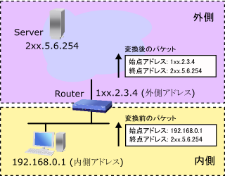

# NAT 디스크립터

- NAT 기능은 라우터가 전송하는 IP 패킷의 시작점/끝점 IP주소나 TCP/UDP 포트번호를 변환하는 것으로 주소체계가 다른 IP네트워크를 접속 가능하게 하는 기능
- 야마하 라우터에서는 NAT기능에 대한 일련의 변환 정책을 NAT 디스크립터라고 부르며, NAT 디스크립터의 설정을 하는 것으로 NAT 기능을 사용 가능하게 됨

## 개요

### NAT, NAPT, IP마스커레이드

- 야마하 라우터에서는 주소를 일대일로 대응하여 변환하는 것을 NAT, 복수의 주소를 하나의 주소로 변환하는 것을 IP 마스커레이드라고 부름
- 일반적으로 IP마스커레이드는 NAPT라고 불리고 있지만 야마하 라우터에서는 IP마스커레이드로 표기를 통일하고 있음

### 바인드

- NAT에서는 변환전의 주소와 변환후의 주소를 쌍으로 관리함
- IP마스커레이드에서는 주소에 더해 포트 번호등의 정보도 관리할 필요가 있음
- 야마하 라우터에서는 이러한 변환을 바인드라고 부르며, 바인드를 어떻게 할지 결정하는 것을 바인드한다라고 표기함

### 정적변환과 동적변환

- 미리 바인드 내용이 결정되어 있는 상태를 정적변환이라고 부르며, 바인드의 발생시에 바인드가 결정되는 것을 동적변환이라고 부름
- NAT에서 변환하는 경우는 동적NAT, 정적NAT라고 부르며 IP마스커레이드에서 변환하는 경우에는 동적IP마스커레이드, 정적IP마스커레이드라고 부름
- 동적변환에서는 바인드가 발생하는 시점에 바인드가 결정되어 일정 시간의 수명이 경과하면 바인드가 삭제됨
  - 단, 통신중에 바인드가 삭제되면 통신이 중단되므로, 통신중에는 수명이 줄지 않도록 되어 있음
- 정적변환은 처음부터 바인드가 정해져 있어, 항상 바인드가 존재함
  - 따라서 바인드가 포함된 주소나 포트번호는 패킷의 유무와 관계없이 예약되어 있어, 동적변환에서는 사용되지 않음

### 내부와 외부

- NAT나 IP마스커레이드의 전통적인 용도는 프라이빗 주소를 숨기는 것이었음
- 단말에는 프라이빗 주소를 부여하지만, 프라이빗 주소를 사용해 인터넷과 통신하는 것은 불가능하므로, 단말의 송신 패킷에 포함되는 프라이빗 주소를 글로벌 IP주소로 변환함

- 이 경우 단말의 주소는 변환되지만, 서버의 주소는 변환되지 않으므로 라우터를 경계로 주소를 변환해야 할 네트워크를 내부라고 부르고 그렇지 않은 네트워크를 외부라고 부름
- 많은 케이스에서 내부는 LAN, 외부는 WAN이 되지만, 운용에 따라서는 그렇지 않은 경우도 있음
- 상기의 예에서는 192.168.0.1이 1xx.2.3.4로 변환되지만, 이것은 둘 다 단말을 가리키고 있기 때문에, 이를 구별하기 위해 다르게 부르는 것이 편리함
  - 그렇기 때문에 내부쪽에서 사용하고 있는 주소를 내부 주소, 외부쪽에서 사용하는 주소를 외부 주소라고 불러 구별하고, 상기 도식에서는 192.168.0.1이 내부 주소, 1xx.2.3.4가 외부 주소가 됨
- 내부/외부는 인터페이스의 내부/외부와는 다른 개념으로 앞으로 설명될 내용중 혼란하기 쉬운 상황에서는 NAT/IP마스커레이드의 내부측과 같이 구별 가능한 표현을 사용함
- 다수의 케이스에서는 NAT/IP마스커레이드의 외부를 인터페이스의 외부로 설정하는 것이 알기 쉬운 설정이지만, 네트워크의 구성에 따라서는 역으로 설정해야 하는 경우도 있기 때문에, 야마하 라우터에서는 전자를 순방향, 후자를 역방향이라고 부르고 잇음

### NAT디스크립터

- 야마하 라우터에서는 바인드를 정하기 위한 정책을 NAT디스크립터라고 부르고 있음
- NAT디스크립터의 기본요소는 다음의 5가지임
  - 변환 방식 (NAT, IP마스커레이드)
  - 외부 주소
  - 내부 주소
  - 정적 NAT 바인드
  - 정적 IP마스커레이드 바인드

### 처리 구조상 위치

- NAT디스크립터 기능이 동작하는 타이밍은 패킷을 인터페이스에 송신할때와 인터페이스에서 수신할때임
- 인터페이스의 종류와 관계 없이, LAN, PP, TUNNEL 인터페이스에서 동작함
- PP Anonymous 인터페이스에서도 동작하지만, 상대에 따라서 정책을 변경하는 것은 불가능 하기 때문에 사용이 제한되어 있음
- 필터링이나 라우팅과우 위치 관계는 아래의 구성도처럼 되어 있으며 특히 필터링과 NAT디스크립터의 위치관계가 중요함
- 인터페이스로 송신되는 패킷은 먼저 필터링의 처리를 받고 나서 NAT디스크립터의 처리를 받으며, 반대로 수신되는 패킷은 NAT디스크립터의 처리를 먼저 받음

- 필터링의 설정에서 기재될 주소나 포트번호에 주의할 필요가 있는데, 예를 들어 송신할 패킷을 필터링 할 때, NAT디스크립터가 처리하기 전에 필터링의 처리를 받음으로 필터링 설정에서는 외부 주소가 아닌 내부 주소를 사용함
