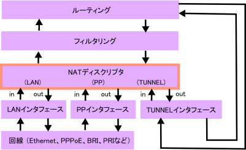

# NAT 디스크립터

- NAT 기능은 라우터가 전송하는 IP 패킷의 시작점/끝점 IP주소나 TCP/UDP 포트번호를 변환하는 것으로 주소체계가 다른 IP네트워크를 접속 가능하게 하는 기능
- 야마하 라우터에서는 NAT기능에 대한 일련의 변환 정책을 NAT 디스크립터라고 부르며, NAT 디스크립터의 설정을 하는 것으로 NAT 기능을 사용 가능하게 됨

## 개요

### NAT, NAPT, IP마스커레이드

- 야마하 라우터에서는 주소를 일대일로 대응하여 변환하는 것을 NAT, 복수의 주소를 하나의 주소로 변환하는 것을 IP 마스커레이드라고 부름
- 일반적으로 IP마스커레이드는 NAPT라고 불리고 있지만 야마하 라우터에서는 IP마스커레이드로 표기를 통일하고 있음

### 바인드

- NAT에서는 변환전의 주소와 변환후의 주소를 쌍으로 관리함
- IP마스커레이드에서는 주소에 더해 포트 번호등의 정보도 관리할 필요가 있음
- 야마하 라우터에서는 이러한 변환을 바인드라고 부르며, 바인드를 어떻게 할지 결정하는 것을 바인드한다라고 표기함

### 정적변환과 동적변환

- 미리 바인드 내용이 결정되어 있는 상태를 정적변환이라고 부르며, 바인드의 발생시에 바인드가 결정되는 것을 동적변환이라고 부름
- NAT에서 변환하는 경우는 동적NAT, 정적NAT라고 부르며 IP마스커레이드에서 변환하는 경우에는 동적IP마스커레이드, 정적IP마스커레이드라고 부름
- 동적변환에서는 바인드가 발생하는 시점에 바인드가 결정되어 일정 시간의 수명이 경과하면 바인드가 삭제됨
  - 단, 통신중에 바인드가 삭제되면 통신이 중단되므로, 통신중에는 수명이 줄지 않도록 되어 있음
- 정적변환은 처음부터 바인드가 정해져 있어, 항상 바인드가 존재함
  - 따라서 바인드가 포함된 주소나 포트번호는 패킷의 유무와 관계없이 예약되어 있어, 동적변환에서는 사용되지 않음

### 내부와 외부

- NAT나 IP마스커레이드의 전통적인 용도는 프라이빗 주소를 숨기는 것이었음
- 단말에는 프라이빗 주소를 부여하지만, 프라이빗 주소를 사용해 인터넷과 통신하는 것은 불가능하므로, 단말의 송신 패킷에 포함되는 프라이빗 주소를 글로벌 IP주소로 변환함


- 이 경우 단말의 주소는 변환되지만, 서버의 주소는 변환되지 않으므로 라우터를 경계로 주소를 변환해야 할 네트워크를 내부라고 부르고 그렇지 않은 네트워크를 외부라고 부름
- 많은 케이스에서 내부는 LAN, 외부는 WAN이 되지만, 운용에 따라서는 그렇지 않은 경우도 있음
- 상기의 예에서는 192.168.0.1이 1xx.2.3.4로 변환되지만, 이것은 둘 다 단말을 가리키고 있기 때문에, 이를 구별하기 위해 다르게 부르는 것이 편리함
  - 그렇기 때문에 내부쪽에서 사용하고 있는 주소를 내부 주소, 외부쪽에서 사용하는 주소를 외부 주소라고 불러 구별하고, 상기 도식에서는 192.168.0.1이 내부 주소, 1xx.2.3.4가 외부 주소가 됨
- 내부/외부는 인터페이스의 내부/외부와는 다른 개념으로 앞으로 설명될 내용중 혼란하기 쉬운 상황에서는 NAT/IP마스커레이드의 내부측과 같이 구별 가능한 표현을 사용함
- 다수의 케이스에서는 NAT/IP마스커레이드의 외부를 인터페이스의 외부로 설정하는 것이 알기 쉬운 설정이지만, 네트워크의 구성에 따라서는 역으로 설정해야 하는 경우도 있기 때문에, 야마하 라우터에서는 전자를 순방향, 후자를 역방향이라고 부르고 잇음

### NAT디스크립터

- 야마하 라우터에서는 바인드를 정하기 위한 정책을 NAT디스크립터라고 부르고 있음
- NAT디스크립터의 기본요소는 다음의 5가지임
  - 변환 방식 (NAT, IP마스커레이드)
  - 외부 주소
  - 내부 주소
  - 정적 NAT 바인드
  - 정적 IP마스커레이드 바인드

### 처리 구조상 위치

- NAT디스크립터 기능이 동작하는 타이밍은 패킷을 인터페이스에 송신할때와 인터페이스에서 수신할때임
- 인터페이스의 종류와 관계 없이, LAN, PP, TUNNEL 인터페이스에서 동작함
- PP Anonymous 인터페이스에서도 동작하지만, 상대에 따라서 정책을 변경하는 것은 불가능 하기 때문에 사용이 제한되어 있음
- 필터링이나 라우팅과우 위치 관계는 아래의 구성도처럼 되어 있으며 특히 필터링과 NAT디스크립터의 위치관계가 중요함
- 인터페이스로 송신되는 패킷은 먼저 필터링의 처리를 받고 나서 NAT디스크립터의 처리를 받으며, 반대로 수신되는 패킷은 NAT디스크립터의 처리를 먼저 받음



- 필터링의 설정에서 기재될 주소나 포트번호에 주의할 필요가 있는데, 예를 들어 송신할 패킷을 필터링 할 때, NAT디스크립터가 처리하기 전에 필터링의 처리를 받음으로 필터링 설정에서는 외부 주소가 아닌 내부 주소를 사용함

## 패킷 처리

### 인터페이스와 NAT디스크립터

- 변환 규칙은 NAT디스크립터마다 정의할수 있고 각각의 인터페이스는 최대 16개의 NAT디스크립터를 가질 수 있음
- 패킷이 인터페이스를 통과할 때, 인터페이스가 가진 NAT디스크립터에 따라 패킷이 변환됨
- 인터페이스가 가지는 NAT디스크립터를 설정하기 위해서는 `ip INTERFACE nat descriptor` 명령어를 사용함
  ```
  ip lan2 nat descriptor 1 2
  ```
  - 위는 LAN2 인터페이스가 가지는 NAT디스크립터의 번호가 1,2이며 순방향으로 적용됨을 의미
- Rev 8.03.37 이후의 펌웨어에서는 순방향에 더해 역방향으로 적용하는 것도 가능해짐
  ```bash
  ip lan2 nat descriptor 1 2 reverse 3 4    # *
  ```
- 또한 순방향의 NAT디스크립터를 삭제하여 다음과 같이 설정하는 것도 가능한데, 예에서 역방향 NAT디스크립터만 적용됨
  ```
  ip lan2 nat descriptor reverse 3 4
  ```
- 방향에 대한 자세한 예를 들면, 패킷을 변환하는 NAT디스크립터는 하나뿐이라는 점
- 예를 들면 위의 `*`의 설정에서는 순방향에 대해서는 1번 NAT디스크립터에서 변환되면 2번은 스킵하고 3번에 이동하며 역방향에 대해서 3번에서 처리되지 않으면 4번에서 처리됨

### 외부로 향하는 패킷의 처리

- 내부에서 외부로 향하는 패킷, 즉 외부로 향하는 패킷의 처리 요건은 다음과 같음
  1. 알려진 흐름과 일치하는지 확인하여 일치하는 경우 과거의 패킷과 같은 변환처리 후 종료
  2. 일치하지 않는 경우에는 먼저 정적 NAT에서 처리가능한지 조사 후 처리 가능하면 NAT변환 후 종료
  3. 정적 IP마스커레이드에서 처리가능한지 확인 후 가능하다면 패킷을 IP마스커레이드로 변환 후 종료
  4. 동적 NAT에서 처리가능한 경우 새로운 바운드를 생성 후 NAT로 변환하여 처리 후 종료
  5. 동적 IP마스커레이드에서 처리 가능한 경우 새로운 바운드를 생성 후 IP마스커레이드로 변환하여 처리 후 종료
  6. 위 모든 경우에서 맞지 않는다면 패킷은 변환하지 않고 통과됨
- 기존 흐름이 아닌 패킷을 처리했을 경우, 그 상태를 NAT 테이블이라고 불리는 캐시에 축적함
- 캐시는 흐름이 계속되고 패킷이 흐르는 동안 유효
- TCP의 경우에는 FIN이나 RST를 관측하면 60초 후에 캐시를 삭제 또는 흐름에 속하는 패킷이 흐르지 않게 되고 나서 일정 시간이 경과할 경우에도 캐시를 삭제
- 캐시를 제거하는 시간을 측정하는 타이머는 기본적으로 900초이지만 `nat descriptor timer` 명령을 이용하여 다른 값으로 변경할 수 있음
- 헤어핀 NAT가 설정되어 있지 않은 경우에는, 외부로 나가는 패킷에 대해서 그 목적지가 NAT나 IP 마스커레이드의 외부 주소/외부 포트에 일치하고 있어도, 되풀이하여 내부의 단말에 전송은 실시하지 않음

### 내부로 향하는 패킷의 처리

- 외부에서 내부로 향하는 패킷, 즉 내부로 향하는 패킷의 처리는 외부로 향하는 패킷의 처리와는 다르게 새로운 바인드가 발생하지 않는다는 점에서 큰 차이가 있음
  1. 알려진 흐름과 일치하는지 확인하여 일치하는 경우 과거의 패킷과 같은 변환처리 후 종료
  2. 일치하지 않는 경우에는 먼저 정적 NAT에서 처리가능한지 조사 후 처리 가능하면 NAT변환 후 종료
  3. 정적 IP마스커레이드에서 처리가능한지 확인 후 가능하다면 패킷을 IP마스커레이드로 변환 후 종료
- 위에 흐름에 일치하지 않으면 다음의 절차에 따라 패킷의 처리를 정함
  1. ICMP의 Echo Request에 대해서는 무조건 Echo Reply를 반환
  2. 그렇지 않으면 nat descriptor masquerade incoming 커맨드에 설정된대로 처리됨
     - reject: 패킷을 파기, 단 TCP에 대해서는 Reset(RST)를 반환
     - discard: 패킷을 파기
     - through: 패킷을 변환하지 않고 통과시킴
     - forward: 패킷을 특정 단말로 전송
- nat descriptor masquerade incoming 명령어는 내부로 향하는 패킷을 변환할수 없을때 동작하는 정의문으로, 보안관점에서 주의가 필요한 명령임
- 특히 forward를 설정한 경우에는 내부의 단말로 패킷을 전송하므로 외부에서 내부로의 엑세스를 허용하는 것이 됨 (이는 DMZ HOST라고 불리는 경우가 많은데 방화벽의 DMZ와는 의미가 다른것에 주의)

### 프로토콜의 처리

- 크게 나누어 TCP, UDP, UCMP, 그외의 4가지의 룰로 분류 가능

### TCP

- TCP 패킷을 변환하는 케이스에서는 NAT에서 IP헤더의 주소를 변환하고, IP마스커레이드에서는 주소에 더해 TCP헤더의 포트번호를 변환
- 일부 TCP 어플리케이션에서는 TCP 데이터부분을 덮어쓸 필요가 있어 그때 메시지의 길이가 변경되는 경우가 있는데, 이 경우 TCP헤더의 시퀀스변호도 덮어쓰기 대상이 됨
- TCP 커넥션에서는 FIN플래그나 RST플래그에 의해 명시적으로 커넥션을 종료를 알리는 것이 가능
- 이렇게 플래그를 관측하는 경우에는 대응하는 패킷의 TTL을 60초까지 줄여, 조기에 바인드를 해소시키는데, 이러한 플래그가 발생하지 않더라도 패킷의 흐름이 없는 상태로 일정 시간이 지나면 자동으로 바인드를 해소함

### UDP

- NAT에서는 IP헤더의 주소를 변환하고 IP마스커레이드에서는 주소에 더해 UDP헤더의 포트번호를 변환
- UDP 커넥션에서는 종료에 대응하는 명시적인 트리거가 없기 때문에 패킷이 도달하지 않으면 일정 시간이 경과하고 바인드를 해소함

### ICMP

- ICMP 패킷중 ICMP Echo와 ICMP Echo Reply에 대해서 Identifier 필드를 변환하는데, 이 필드를 변환하는 것으로 내부의 복수 단말에 동시에 핑을 실행하는 것이 가능해짐
- Destination Unreachable, Source Quench, Time Exceeded, Parameter Problem에 대해서는 IP헤더의 주소에 더해 헤더부분에 들어있는 패킷이 변환 대상이 됨

### 기타 프로토콜

- TCP, UDP, ICMP해당하지 않는 패킷에 대해서는 IP헤더의 주소만이 변환 대상이 되므로 설정에 관계없이 모든 변환은 NAT가 됨
- 엄밀히 말하면 설정이 IP마스커레이드라면 내부적으로는 IP마스커레이드의 취급이 됨
- 예를 들어 syslog는 여전히 IP마스커레이드의 바인드를 출력함
- 하지만 실제로는 NAT와 동일하며 변환 후의 패킷은 NAT와 동일한 결과가 됨
- 실제로는 NAT이기 때문에 IP마스커레이드로 변환할 때도 내부 단말은 하나만 통신할 수 있음
- 전통적은 예로는 IPSec ESP가 있는데 추후 설명됨
