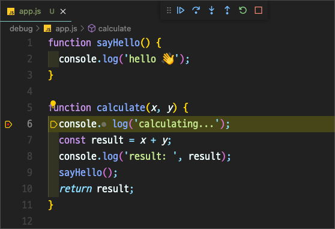

# Debugging

- 배포할때, 문제가 생겼을때, 버그에 직면했을때
- 디버깅이랑 코드에서 정확하게 어디서 문제가 발생하는지 찾아서 버그를 잡아나가는 과정
- 디버깅에서 제일 중요한 것은 문제를 정의하는 것
- 현재 상황과 원하는 상황과의 갭을 메워 나가는 과정

unit testing

integration testing

control flow analysis

log file analysis print logs

interactive debugging

memory dumps

profiling

## 디버깅하기

- VSC에서 breakpoint를 잡고 Run and Debug를 실행
  - continue: 다음 브레이크포인트로 이동
  - step over: 코드에서 다음 라인을 계속해서 수행, 함수를 따라가지 않음
  - step in: 함수를 따라갈수 있는 경우 따라들어감
  - step out: 함수를 수행하는 도중 나감
  - restart
  - stop
- 브레이크 포인트는 표현식을 이용해서 조건이 맞을 때만 브레이크 포인트 수행을 지정할 수 있음

### watch

- 디버거가 들어간 시점에서 원하는 변수나 로직의 상태를 주시할 수 있음

### call stack

- 현재 콜스택에 어떤 것이 주입되어 있는지 확인

### breakpoints

- 찍어놓은 브레이크 포인트를 활성화/비활성화 가능

### 디버거의 pros

- 어플리케이션을 디버깅할때 log를 출력하는 방식을 많이 사용하지만, 이 방식은 어플리케이션의 빌드, 실행까지 시간이 걸리는 경우에 생산성이 저하될 수 있음
- 디버거는 실행 도중에도 변수의 값 등을 조절해가면서 테스트를 수행할 수 있음
