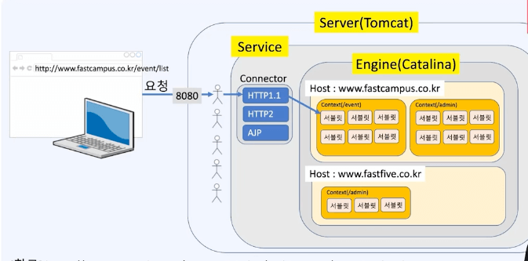
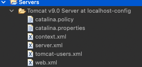

# 클라이언트와 서버

## 클라이언트와 서버

- 무엇을 클라이언트, 서버라고 부를지는 역할에 따른 구분됨

### 클라이언트 (`client`)

- 서비스를 요청하는 어플리케이션 또는 컴퓨터

### 서버 (`server`)

- 서비스를 제공하는 어플리케이션 또는 컴퓨터
- 어떤 서비스를 제공하는지에 따라 각각 다른 이름으로 불림
  - Email server
  - File server
  - Web server


- 같은 호스트 내에 여러가지 종류의 서버를 가동할 수 있고, 포트번호로 분류함
  
  - 서버의 경우 항상 대기해야 하는데, 이를 리스닝(listening)한다 라고 함
  - 포트번호는 예약번호(0~1023), 이후 65535까지는 자유롭게 사용 가능

## 웹 어플리케이션 서버(`WAS`)란?

- 웹 어플리케이션을 서비스 하는 서버
- 웹 브라우저를 통해 서버에 원격 호출(`URI`등)을 통해 서버에 접근하고, 서버는 실행 결과를 전송

## Tomcat의 내부구조



- 웹 브라우저에서 요청이 오면 서버 내 톰캣은 각각의 요청에 대해 스레드(`Thread`)를 작성
- 톰캣은 요청을 분석
  - `Connector (Protocol : HTTP1.1, HTTP2, AJP)`
    - 프로토콜에 맞는 커넥터가 요청을 프로세싱 (`Request`, `Response` 객체 등을 생성)
  - `Host (Domain)`
  - `Context (Project)`
    - `Spring Project`
  - `URI`
    - `Method`
  - `Servlet`
    - `Controller`
- 컨텍스트 내 `URI`와 연결된 메서드(서블릿)을 병렬적으로 생성해서 요청과 매치시켜줌
  - `DispatcherServlet`이 `Controller`의 메서드를 호출

## Tomcat의 설정 파일

- `${TOMCAT_ROOT}/conf/server.xml`
  - `Tomcat` 서버 설정 파일
- `${TOMCAT_ROOT}/conf/web.xml`
  - `Tomcat`의 모든 `webapp`의 공통 설정
- `${WEBAPP_NAME}/WEB-INF/web.xml`
  - `webapp`의 개별 설정
  - `STS`에서는 `프로젝트명/src/main/webapp/WEB-INF/web.xml`
  - `IntelliJ`에서는 `프로젝트명/src/main/webapp/WEB-INF/web.xml`

### 이클립스상에서의 서버 설정



이클립스 상의 Servers

- 이클립스에서 표시되는 `Servers`는 `Tomcat`의 `conf`폴더에 있는 설정파일들의 복사본일 뿐임
- 따라서 이 파일을 변경한다고 해도 원본에는 문제가 없으며, 이 파일들의 생성 시점은 서버를 최초 등록할때 각각 서버의 별칭으로 추가가 가능한데 그때 별도로 등록됨

### 서블릿과 스프링의 차이점

- 원래 서블릿은 톰캣상에서 `web.xml` 파일을 통해 컨트롤러 등록이나 메서드의 매핑등을 전부 수동으로 해야 했음
- 스프링에서는 `web.xml` 수동 설정을 어노테이션을 통해 자동으로 할 수 있도록 바뀜
  - `@RequestMapping`

```xml
<!-- The mapping for the default servlet -->
<servlet-mapping>
    <servlet-name>default</servlet-name>
    <url-pattern>/</url-pattern>
</servlet-mapping>

<!-- The mappings for the JSP servlet -->
<servlet-mapping>
    <servlet-name>jsp</servlet-name>
    <url-pattern>*.jsp</url-pattern>
    <url-pattern>*.jspx</url-pattern>
</servlet-mapping>

<!-- 어노테이션으로 자동 등록 -->
<servlet>
	<servlet-name>appServlet</servlet-name>
	<servlet-class>org.springframework.web.servlet.DispatcherServlet</servlet-class>
	<init-param>
		<param-name>contextConfigLocation</param-name>
		<param-value>/WEB-INF/spring/appServlet/servlet-context.xml</param-value>
	</init-param>
	<load-on-startup>1</load-on-startup>
</servlet>

<servlet-mapping>
	<servlet-name>appServlet</servlet-name>
	<url-pattern>/</url-pattern>
</servlet-mapping>
```

<aside>
💡 스프링에서도 `web.xml` 설정을 수동으로 해줄 수 있지만.. 어노테이션을 사용 (관리의 편의성)

</aside>
