# MacOS M1칩셋에서 프로젝트 실행

## STS4 다운로드 및 설치

### STS4 다운로드

[Spring Tools 4 is the next generation of Spring tooling](https://spring.io/tools)

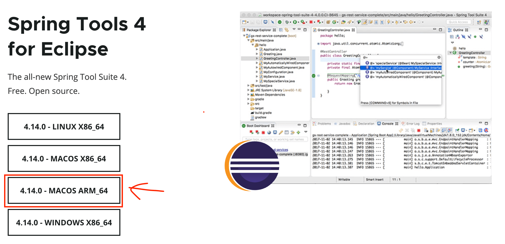

### STS4 설치

- 다운받은 파일을 더블클릭하면, 아래와 같은 화면이 나타남. 왼쪽 녹색 아이콘을 오른쪽 폴더로 드래그

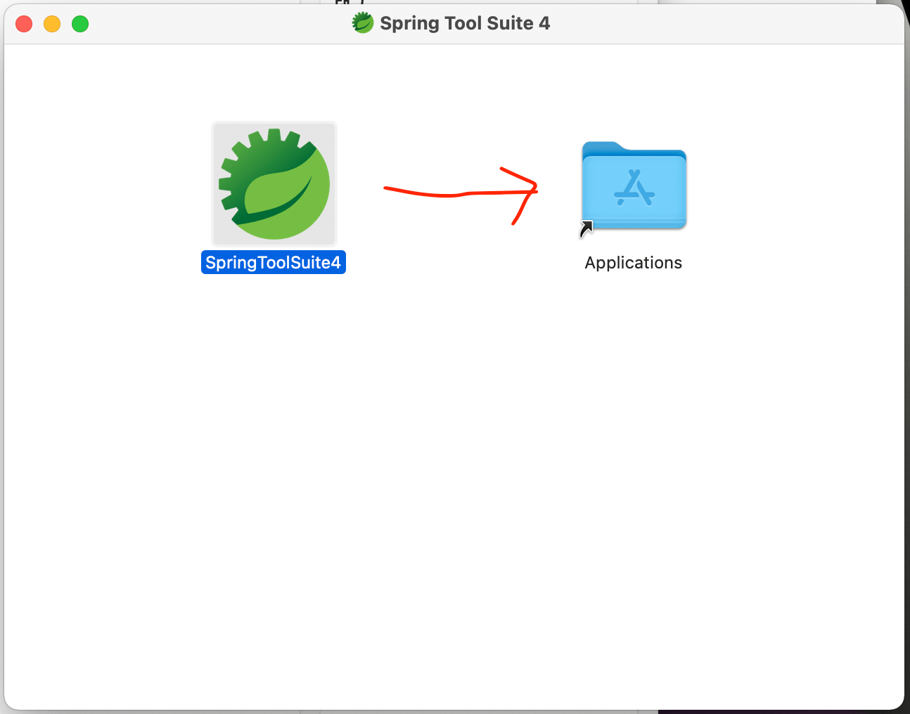

### `STS4`의 실행

- `Finder`에서 왼쪽 응용 프로그램 클릭하고, 오른쪽에서 `SpringToolSuite4`를 클릭하면 아래와 같은 화면이 나타남
- 아래의 화면에서 체크박스 체크후, `Launch`를 클릭.

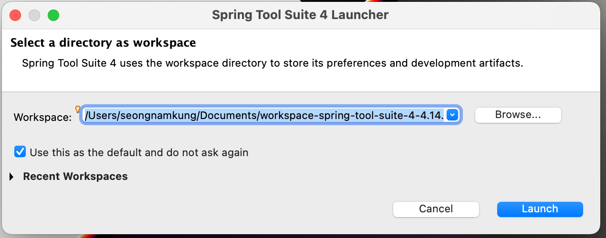

### `ch2`프로젝트 `import`하기

- `github`에서 `ch2.zip`을 다운로드

- `STS4`에서 `import projects...`를 클릭 (또는 빈 공간에서 우클릭 > `import`)

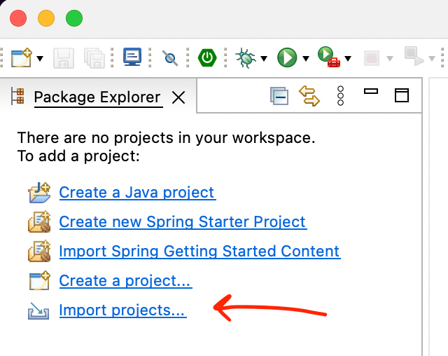

- 아래의 화면에서 `Existing Projects into Workspace`클릭, `Next`클릭

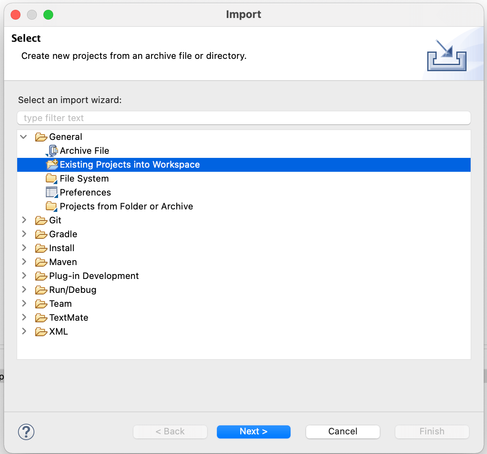

- `Browse`를 클릭해서 `ch2.zip`을 지정후, `Finish`클릭

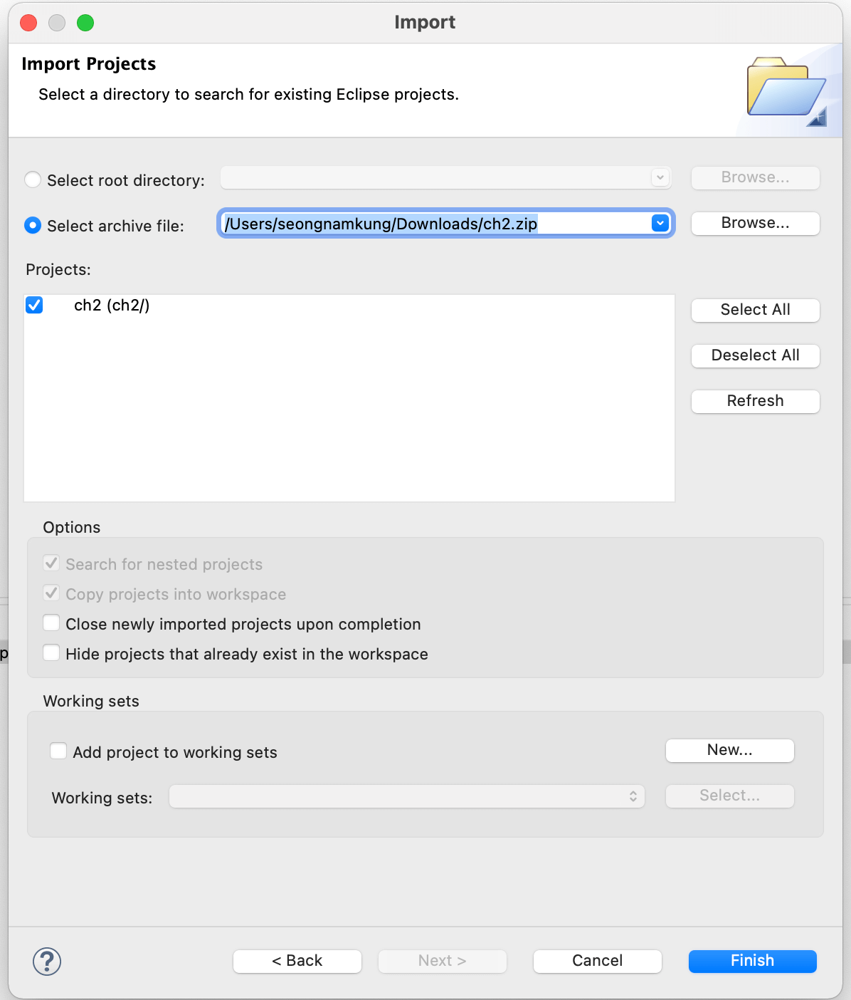

### `Tomcat`을 서버로 등록하기

- `STS4`의 메뉴에서 `Window > Show View > Other...`

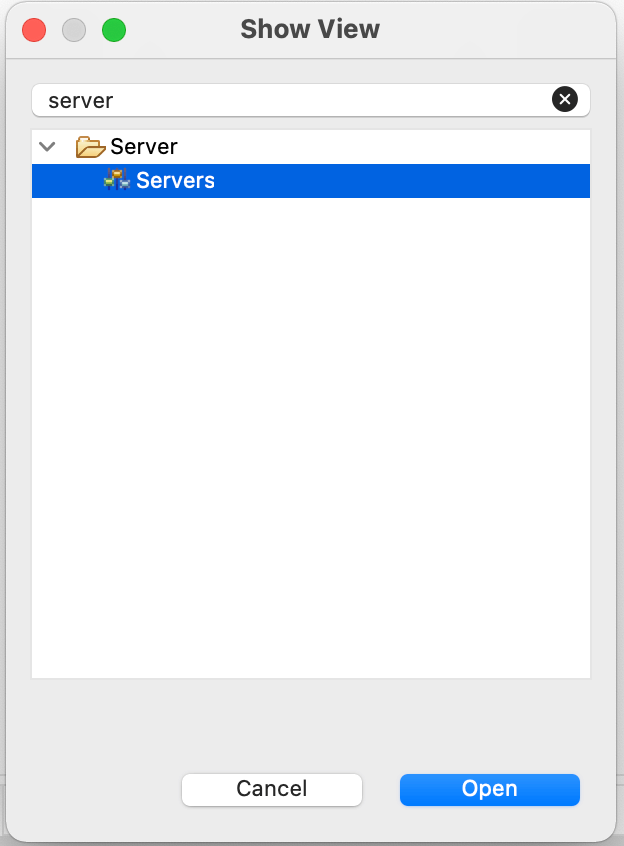

- `Servers`뷰에서, `No servers...`링크를 클릭

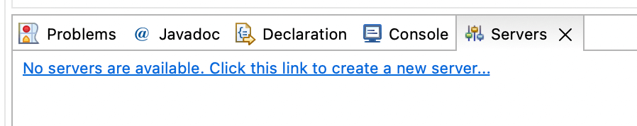

- `Apache`아래의 `Tomcat v9.0 Server`를 선택하고, `Next`를 클릭

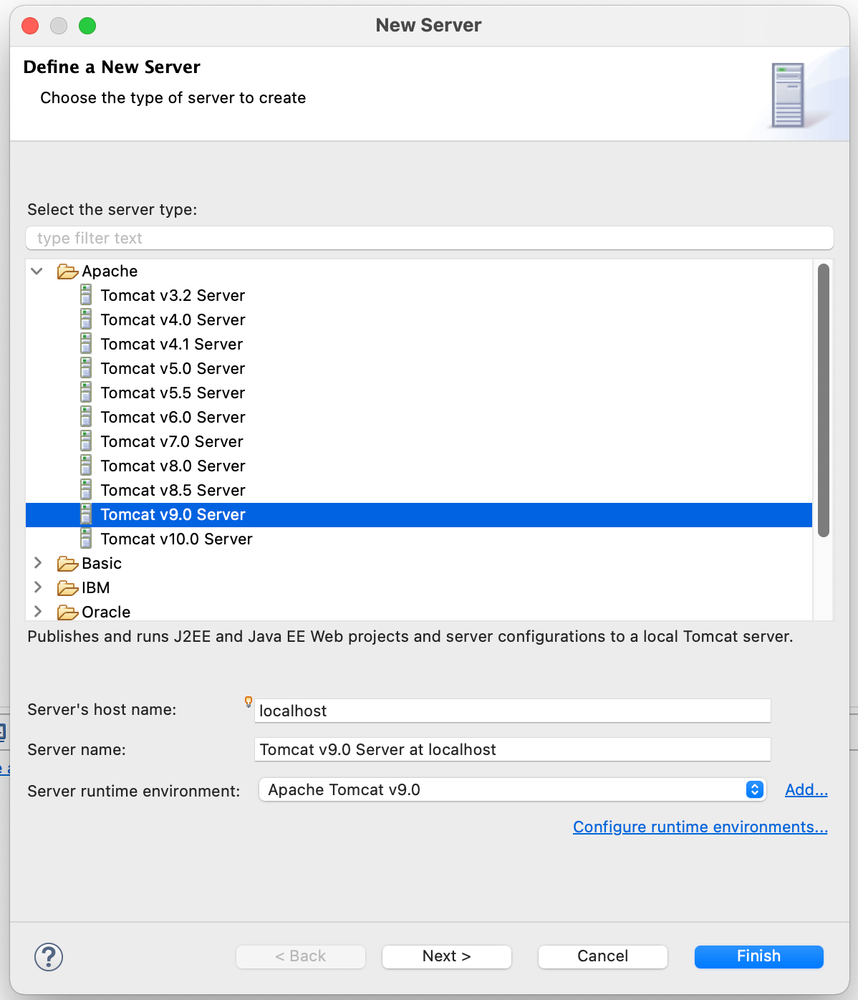

- 아래의 화면에서 `ch2`를 클릭하고, `Add`를 클릭한 후 `Finish`클릭.

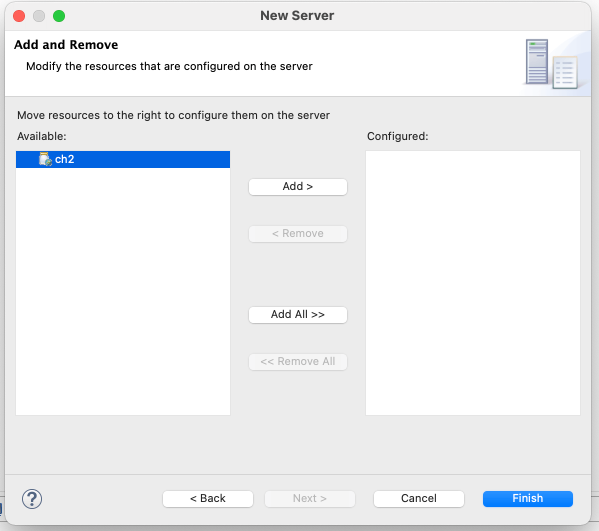

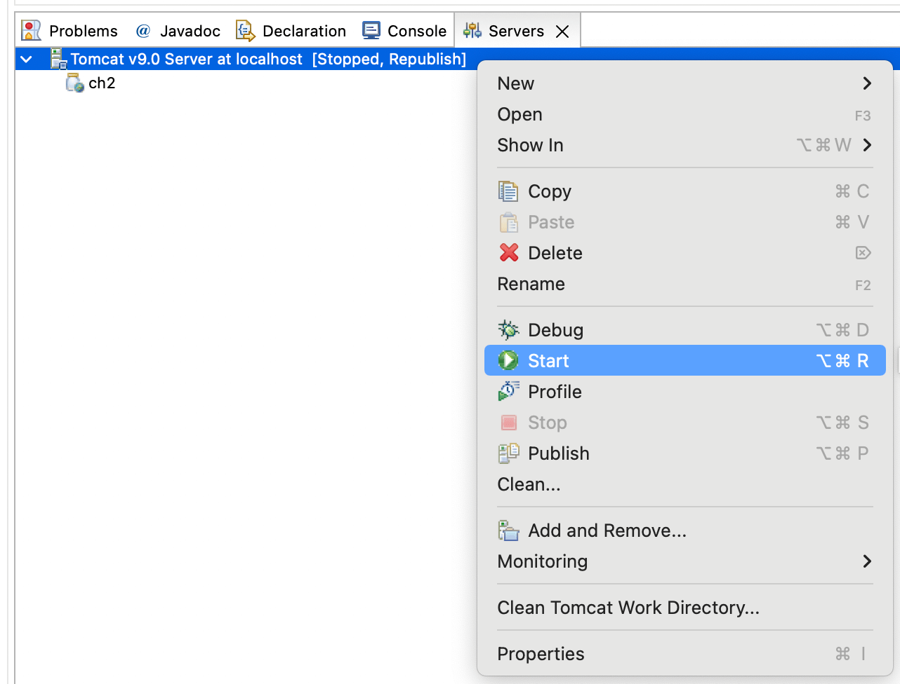

- 브라우저를 열고, `http://localhost:8080`을 방문하면 아래와 같이 나와야 함.

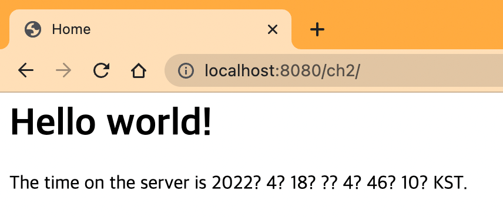
