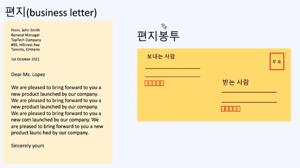
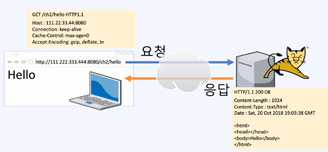
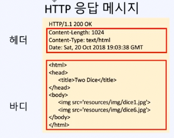
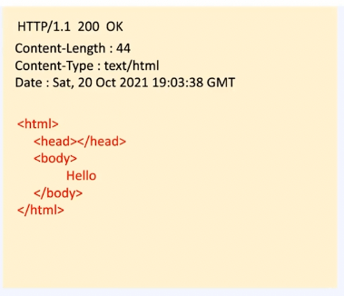
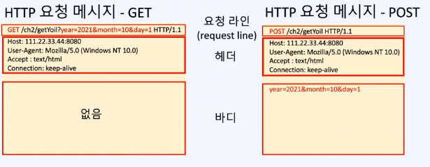

# HTTP요청과 응답

## `HttpServletRequest`

- 톰캣은 클라이언트로부터의 요청을 `HttpServletRequest` 객체로 만들어서 메서드에 매개변수로 전달

```java
public static void main(String args[]) // 일반 자바 프로그램

@RequestMapping("/request")
public void main(HttpServletRequest request) // 톰캣 (단, 자바 어플리케이션과 다르게 main이 기동부는 아님)
```

- 서블릿에서는 모든 매개변수를 전부 입력해야 됐지만, 스프링부터는 `@RequestMapping` 에서 매핑된 메서드의 인자로 필요한 것만 명시하면 되도록 바뀜

### `HttpServletRequest`의 메서드


### 쿼리 스트링 (`query string`) 사용법

- `request` 객체 내부에 제공되는 메서드인 `getParameter()` 를 이용함
  - `java.lang.String getParameter()`
  - `java.util.Enumeration<java.lang.String> getParameterNames()`
  - `java.util.Map<java.lang.String,java.lang.String[]> getParameterMap()`

```java
String year = request.getParameter("year");
String month = request.getParameter("month");
String day = request.getParameter("day");
```

- 쿼리 스트링은 기본 문자열이기 때문에 프로그램 내부에서는 적절한 형변환이 필요
  - `Interger.parseInt()`
  - `Double.parseDouble()`
  - …

```java
package com.fastcampus.ch2;

import org.springframework.stereotype.Controller;
import org.springframework.web.bind.annotation.RequestMapping;

import javax.servlet.http.HttpServletRequest;

@Controller
public class RequestInfo {
    @RequestMapping("/requestInfo")
    //    public static void main(String[] args) {
    public void main(HttpServletRequest request) {
        System.out.println("request.getCharacterEncoding()="+request.getCharacterEncoding()); // 요청 내용의 인코딩
        System.out.println("request.getContentLength()="+request.getContentLength());  // 요청 내용의 길이. 알수 없을 때는 -1
        System.out.println("request.getContentType()="+request.getContentType()); // 요청 내용의 타입. 알 수 없을 때는 null

        System.out.println("request.getMethod()="+request.getMethod());      // 요청 방법
        System.out.println("request.getProtocol()="+request.getProtocol());  // 프로토콜의 종류와 버젼 HTTP/1.1
        System.out.println("request.getScheme()="+request.getScheme());      // 프로토콜

        System.out.println("request.getServerName()="+request.getServerName()); // 서버 이름 또는 ip주소
        System.out.println("request.getServerPort()="+request.getServerPort()); // 서버 포트
        System.out.println("request.getRequestURL()="+request.getRequestURL()); // 요청 URL
        System.out.println("request.getRequestURI()="+request.getRequestURI()); // 요청 URI

        System.out.println("request.getContextPath()="+request.getContextPath()); // context path
        System.out.println("request.getServletPath()="+request.getServletPath()); // servlet path
        System.out.println("request.getQueryString()="+request.getQueryString()); // 쿼리 스트링

        System.out.println("request.getLocalName()="+request.getLocalName()); // 로컬 이름
        System.out.println("request.getLocalPort()="+request.getLocalPort()); // 로컬 포트

        System.out.println("request.getRemoteAddr()="+request.getRemoteAddr()); // 원격 ip주소
        System.out.println("request.getRemoteHost()="+request.getRemoteHost()); // 원격 호스트 또는 ip주소
        System.out.println("request.getRemotePort()="+request.getRemotePort()); // 원격 포트
    }
}
```

```
[실행결과] http://localhost:8080/ch2/requestInfo?year=2021&month=10&day=1

request.getCharacterEncoding()=UTF-8
request.getContentLength()=-1
request.getContentType()=null
request.getMethod()=GET
request.getProtocol()=HTTP/1.1
request.getScheme()=http
request.getServerName()=localhost
request.getServerPort()=8080
request.getRequestURI()=http://localhost:8080/ch2/requestInfo
request.getRequestURI()=/ch2/requestInfo
request.getContextPath()=/ch2
request.getServletPath()=/requestInfo
request.getQueryString()=year=2021&month=10&day=1
request.getLocalName()=localhost
request.getLocalPort()=8080
request.getRemoteAddr()=0:0:0:0:0:0:0:1   <--- AWS에 배포(deploy)한 다음에 실행하면, 실제 ip주소를 확인할 수 있음.
request.getRemoteHost()=0:0:0:0:0:0:0:1   <--- AWS에 배포(deploy)한 다음에 실행하면, 실제 ip주소를 확인할 수 있음.
request.getRemotePort()=54855
```

### 동적 리소스

- 실행 시 마다 결과가 변함
- java 파일로 작성된 `HttpServletResponse` 객체
  - 런타임의 입력, 코딩 내용에 따라 실행할 때 마다 다양한 결과값을 도출할 수 있음

### 정적 리소스

- `images`, `css`, `js`, `html` 등과 같이 파일로 미리 준비되어 있는 리소스
- 파일 형태로 제공, `read only`의 특성을 지님

## 프로토콜(`protocol`)이란?



- 서로 간의 통신을 위한 약속, 규칙
- 주고 받을 데이터에 대한 형식을 정의한 것

## HTTP(`Hyper Text Transfer Protocol`)란?



- 단순하고 읽기 쉬움
- 텍스트 기반의 프로토콜
- 상태를 유지하지 않음 (`stateless`) 즉, 클라이언트의 정보를 저장하지 않음
  - 이를 보완하기 위해 쿠키(`Cookie`), 세션(`Session`)을 이용
- 확장 가능함
  
  - 커스텀 헤더(header) 추가 가능

## HTTP 메시지 (응답 메시지)



- 상태 코드 (상태 라인) `Status Line`
  - `1xx` → `Informational`
  - `2xx` → `Success`
  - `3xx` → `Redirect`
  - `4xx` → `Client Error`
  - `5xx` → `Server Error`
- 헤더 (`Header`)
  - `Content-Length`
  - `Content-Type`
  - `Date`
  - …
- 바디 (`Body`)
  - 실제 응답 내용

## HTTP 메시지 (요청 메시지)



- 요청 라인 (`Request Line`)
  - GET
    - 서버의 리소스를 가져오기 위해 설계
    - 쿼리 스트링(`Query String`)을 통해 데이터를 전달(소용량)
    - `URL`에 데이터가 노출되므로 보안에 취약
    - 데이터 공유에 유리
    - 유스케이스
      - 검색엔진에서 검색단어 전송 등에 이용
  - POST
    - 서버에 데이터를 올리기 위해 설계됨
    - 전송 데이터 크기의 제한이 없음(대용량)
      - 단, 서버에서 처리하는 용량에 한도가 있을 가능성 있음
    - 데이터를 요청 메시지의 `body`에 담아 전송
    - 보안에 유리, 데이터 공유에는 불리
      - 단, `TLS`적용을 통해 `body`를 암호화 하는 경우에 한정
      - 평문 `body`는 스니핑 및 인스펙션이 가능
    - 유스케이스
      - 게시판에 글쓰기, 로그인, 회원가입
  - PUT
  - DELETE
  - …
- 헤더 (`Header`)
- 바디 (`Body`)
  - 서버에 전송할 데이터

## Base64


- Base64는 64진법
- 데이터를 표현하는 하나의 방식
- 2진수를 6비트씩 잘라서 변환
- 바이너리 데이터를 텍스트 데이터로 변환할 때 사용
- `A~Z, a~z, 0~9, +, /` 등과 같은 기호는 어떤 OS, 어떤 기종의 컴퓨터든 전부 가지고 있기 때문에 바이너리를 해당 기호들로 변환해서 표현하면 상호 호환이 가능하게 됨
- 유스케이스
  - Base64를 통해 이미지와 같은 바이너리를 텍스트로 변환해서 전송
    - 원래의 데이터 mime type
    - 실질적인 데이터
  - 서버측에서 전달받은 Base64를 바이너리로 조합
    - 전달받은 mime type의 규칙에 의거
    - 데이터 조합
