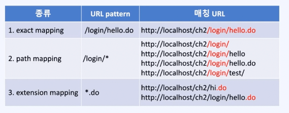

# Spring MVC

## `@RequestParam`과 `@ModelAttribute`

### `@RequestParam`

- 요청의 파라미터(`Parameter`)를 연결할 매개변수에 붙이는 애너테이션(`Annotation`)
- `@RequestParam`을 생략했을때는 `name`은 매개변수의 이름으로, `required=false`로 자동지정됨
  ```java
  @RequestMapping("/requestParam2")
  // public String main2(@RequestParam(name="year", required=false) String year) {   // 아래와 동일
  public String main2(String year) {
  // http://localhost/ch2/requestParam2         ---->> year=null
  // http://localhost/ch2/requestParam2?year    ---->> year=""
  	System.out.printf("[%s]year=[%s]%n", new Date(), year);
  	return "yoil";
  }
  ```
- @RequiredParam만 붙였을때는 name은 매개변수 이름으로, required=true로 자동지정됨
  ```java
  @RequestMapping("/requestParam3")
  // public String main3(@RequestParam(name="year", required=true) String year) {   // 아래와 동일
  public String main3(@RequestParam String year) {
  // http://localhost/ch2/requestParam3         ---->> year=null   400 Bad Request. required=true라서
  // http://localhost/ch2/requestParam3?year    ---->> year=""
  	System.out.printf("[%s]year=[%s]%n", new Date(), year);
  	return "yoil";
  }
  ```
- @RequiredParam(required=false) 지정 후 매개변수를 int로 지정했을때는 경우에 따라 다른 결과가 발생
  - 쿼리 스트링(Query String)을 생략할 수 있지만, 생략한 경우에는 null이 되므로 int로의 형변환이 불가능하여 IllegalStateException 예외 발생
  - 쿼리 스트링(Query String)을 생략하지 않았지만 아무런 값을 주지 않으면 빈 문자열`"”`이 되므로 이를 int로 변환하지 못해 NumberFormatException 예외 발생
  ```java
  @RequestMapping("/requestParam8")
  public String main8(@RequestParam(required=false) int year) {
  //	http://localhost/ch2/requestParam8        ---->> 500 java.lang.IllegalStateException: Optional int parameter 'year' is present but cannot be translated into a null value due to being declared as a primitive type. Consider declaring it as object wrapper for the corresponding primitive type.
  //	http://localhost/ch2/requestParam8?year   ---->> 400 Bad Request, nested exception is java.lang.NumberFormatException: For input string: ""
  	System.out.printf("[%s]year=[%s]%n", new Date(), year);
  	return "yoil";
  }
  ```
  - 이를 방지하기 위해 String이 아닌 다른 기본형으로 매개변수를 입력받을때는 주의가 필요하며, 최소한 서버 에러를 막기 위해서는 기본값을 지정하는것이 중요
  ```java
  @RequestMapping("/requestParam11")
  public String main11(@RequestParam(required=false, defaultValue="1") int year) {
  //		http://localhost/ch2/requestParam11        ---->> year=1
  //		http://localhost/ch2/requestParam11?year   ---->> year=1
  	System.out.printf("[%s]year=[%s]%n", new Date(), year);
  	return "yoil";
  }
  ```

### 결론 (`Conclusion`)

- `@RequestParam(required=true)`는 클라이언트에게 값을 잘 줄것을 위임, 아닌 경우 400에러가 발생하므로 예외 핸들링을 잘 해야 함
- `@RequestParam(required=false)`로 사용할거면 defaultValue를 지정해줄것

## @ModelAttribute

- 적용 대상을 Model의 속성으로 자동 추가해주는 애너테이션
- 반환 타입 또는 컨트롤러 메서드의 매개변수에 적용 가능

```java
@RequestMapping("/getYoilMVC5") // http://localhost/ch2/getYoilMVC5?year=2021&month=10&day=1
//public String main(@ModelAttribute("myDate") MyDate date, Model m) { // 아래와 동일
public String main(@ModelAttribute MyDate date, Model m) { // @ModelAttribute사용, 반환 타입은 String
	System.out.println("myDate="+date);

	// 1. 유효성 검사
	if(!isValid(date)) {
		return "yoilError";
	}

  // 2. 처리
	char yoil = getYoil(date);

	// 3. Model에 작업한 결과를 저장
  //@ModelAttribute 덕분에 MyDate를 저장안해도 됨. View로 자동 전달됨.
	//m.addAttribute("myDate", date);
	//m.addAttribute("yoil", yoil);

	// 4. 작업 결과를 보여줄 뷰의 이름을 반환
	return "yoil";
}

private @ModelAttribute("yoil") char getYoil(MyDate date) {
	return getYoil(date.getYear(), date.getMonth(), date.getDay());
}
```

- 실은 참조형일 경우 @ModelAttribute 자체도 생략 가능
  - 참조형일 경우 @ModelAttribute이 생략 되어 있음
  - 기본형일 경우 @RequestParam이 생략 되어 있음

## WebDataBinder

```java
@RequestMapping("/getYoilMVC5")
public String main(MyDate date, BindingResult result) {

// http://localhost/ch2/getYoilMVC5?year=2021&month=10&day=1

"year" "2021"
"month" "10"
"day" "1"
//--- 타입변환 및 데이터 검증
MyDate.year = 2021
MyDate.month = 10
MyDate.day = 1
```

- `BindingResult`에 `MyDate date`에 대한 타입 변환 및 데이터 검증 결과를 담아서 보냄
- 단 참조형 객체 바로 뒤에 명시적으로 `BindingResult`가 정의되어 있을때 한함

## @GetMapping과 @PostMapping

### @GetMapping과 @PostMapping

- @RequestMapping대신 @GetMapping, @PostMapping 사용 가능

```java
@Controller
public class RegisterController {

//	@RequestMapping(value = "/register/add", method = { RequestMethod.GET, RequestMethod.POST })
	 	@GetMapping("/register/add")
		public String register() {
			return "registerForm";
		}

	// @RequestMapping(value = "/register/save", method = RequestMethod.POST)
	@PostMapping("/register/save") // Spring 4.3
	public String save(User user, Model model) throws Exception {
		// 1. validation check
		if (!isValid(user)) {
			String msg = URLEncoder.encode("id를 잘못 입력하셨습니다.", "utf-8");
			model.addAttribute("msg", msg);
			return "redirect:/register/add";
		}

		// 2. save new user to db
		return "registerInfo";
	}

	private boolean isValid(User user) {
		return true;
	}

}
```

### 클래스에 붙이는 @RequestMapping

- 맵핑될 URL의 공통 부분을 @RequestMapping으로 클래스에 적용

```java
@Controller
@RequestMapping("/register")
public class RegisterController {

//	@RequestMapping(value = "/register/add", method = { RequestMethod.GET, RequestMethod.POST })
	@GetMapping("/add")
	public String register() {
		return "registerForm";
	}

	// @RequestMapping(value = "/register/save", method = RequestMethod.POST)
	@PostMapping("/save") // Spring 4.3
	public String save(User user, Model model) throws Exception {
		// 1. validation check
		if (!isValid(user)) {
			String msg = URLEncoder.encode("id를 잘못 입력하셨습니다.", "utf-8");
			model.addAttribute("msg", msg);
			return "redirect:/register/add";
		}

		// 2. save new user to db
		return "registerInfo";
	}

	private boolean isValid(User user) {
		return true;
	}

}
```

### @RequestMapping의 URL패턴



- ?는 한 글자, \*는 여러 글자, \*\*는 하위 경로 포함하는 패턴 매칭 적용
- 배열로 여러 패턴을 한꺼번에 지정 가능

### URL인코딩 → 퍼센트 인코딩

- URL에 포함된 non-ASCII 문자를 문자 코드(16진수) 문자열로 반환
- `URLEncoder.encode()`
- `URLEncoder.decode()`
- non-ASCII를 이해하지 못하는 서버, OS도 있기 때문에 표준어인 ASCII로 코드를 변환해서 이용
