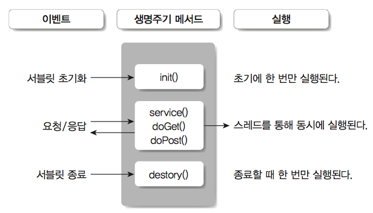
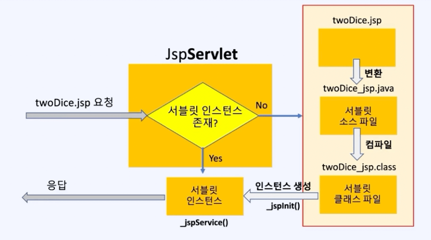
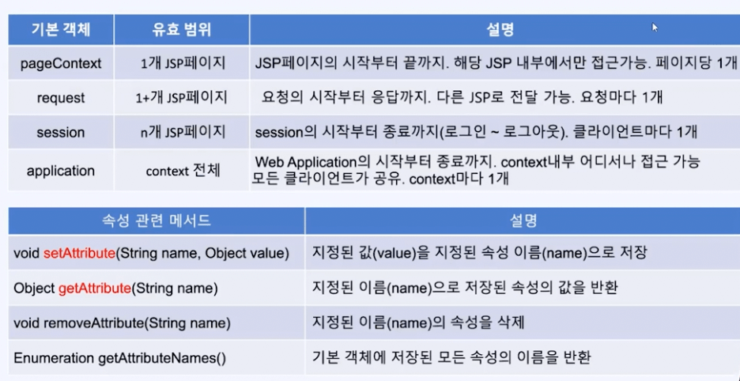
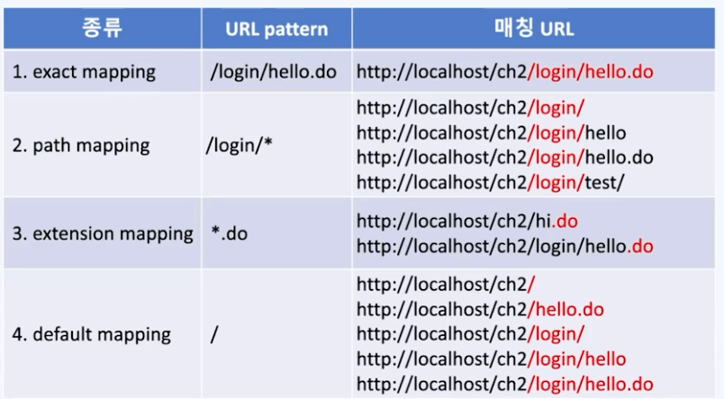
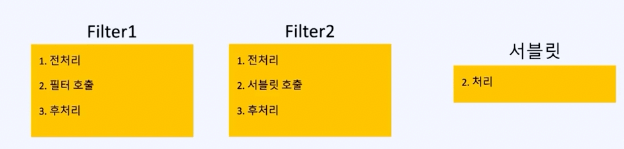

# 서블릿과 JSP

## 서블릿과 컨트롤러의 비교

```java
@WebServlet("/rollDice2")
public class TwoDiceServlet extends HttpServlet {
	int getRandomInt(int range) {
		return new Random().nextInt(range)+1;
	}

	public void service(HttpServletRequest request, HttpServletResponse response) throws IOException {
		int idx1 = getRandomInt(6);
		int idx2 = getRandomInt(6);

		response.setContentType("text/html");
		response.setCharacterEncoding("utf-8");
		PrintWriter out = response.getWriter();
		out.println("<html>");
		out.println("<head>");
		out.println("</head>");
		out.println("<body>");
		out.println("");
		out.println("");
		out.println("</body>");
		out.println("</html>");
		out.close();
	}
}
```

- `@WebServlet` 어노테이션은 스프링의 `@Controller + @RquestMapping` 어노테이션의 조합
- 서블릿에서는 모든 클래스가 `HttpServlet`을 상속받음
- 상속에 의해 `service()` 메서드를 오버라이딩 해야 함
- 서블릿은 컨트롤러와 다르게 클래스에만 매핑을 해야 하기 때문에, 경로가 추가되면 새로운 서블릿 클래스를 만들어야 함

## 서블릿 라이프 사이클



서블릿 생명주기

- 서블릿 컨테이너가 자동으로 호출

```java
// 서블릿 초기화 - 서블릿이 생성 또는 리로딩 때, 단 한번만 수행됨
public void init()

// 호출될 때 마다 반복적으로 수행됨
public void service()

// 뒷정리 작업 - 서블릿이 제거(unload)될 때, 단 한번만 수행됨
public void destroy()
```

- 서블릿은 싱글톤(`Singleton`) 패턴으로 구성되어 있음
  - 요청할때마다 새로운 객체를 만드는것이 아닌, 동일한 객체를 호출
  - 동일한 작업을 하기 때문에 굳이 새로운 객체를 만들어낼 이유가 없음

## JSP(`Java Server Pages`)란?

- `HTML`안에 자바 코드를 삽입한 형태
- 일반적인 `HTML` 코드에 `<%` , `%>` 를 통해 자바 코드를 수행하도록 할 수 있음

### 서블릿과의 차이?

- `JSP`는 `HTML`코드 안에 자바 코드를 삽입하지만, 서블릿은 자바 코드 안에서 `HTML` 출력문을 작성

```html
<%@ page contentType="text/html;charset=utf-8"%> <%@ page
import="java.util.Random" %> <%-- <%! 클래스 영역 %> --%> <%! int
getRandomInt(int range){ return new Random().nextInt(range)+1; } %> <%-- <%
메서드 영역 - service()의 내부 %> --%> <% int idx1 = getRandomInt(6); int idx2 =
getRandomInt(6); %>
<html>
  <head>
    <title>twoDice.jsp</title>
  </head>
  <body>
    .jpg" />
    .jpg" />
  </body>
</html>
```

## `JSP`의 호출 과정



- `JSP`에 대한 요청이 왔을 때
  - 서블릿 인스턴스가 없다면 `JSP`를 서블릿으로 변경, 컴파일
  - 서블릿 클래스를 통해 서블릿 인스턴스를 만들고 호출
- 서블릿 인스턴스가 없을때 첫 요청의 경우 `JSP`를 서블릿으로 컴파일하고 인스턴스를 작성하기 위해 딜레이 발생
- 서블릿 → `lazy-init` (기본적으로)
- 스프링 → `early-init`

## `JSP`의 기본 객체

- 생성없이 사용할 수 있는 객체
  - **`request`**
  - **`response`**
  - **`session`**
  - `page`
  - `application`
  - `config`
  - **`out`**
  - `exception`

## `JSP` 유효 범위와 속성



`JSP`에서 사용되는 객체들의 유효범위(`scope`)와 속성(`attribute`)

- `HTTP`의 특징 → 상태정보를 저장하지 않는다 (`stateless`)
- 이를 커버하기 위해 저장소를 제공
  - 접근 범위
  - 생존 기간

1. `pageContext`
   - 같은 페이지에서만 접근 가능
   - 요청할때마다 초기화 됨
   - `local variable` 저장
   - 예를 들면 기본 객체
     - `request`
     - `response`
     - …
   - `Read/Write` 가능
2. `application`
   - `WebApp` 전체에서 접근 가능
3. `session`
   - 각각의 클라이언트 연결마다 개별적으로 접근 가능
   - 세션은 쿠키를 이용해서 구현됨
   - 로그인 후 아이디, 장바구니 등
   - 단, 모든 페이지당 클라이언트 만큼의 저장소가 필요하기 때문에 서버 부담(메모리)이 증가하고 따라서 최소한의 데이터만 이용하도록 해야 함
4. `request`
   - 요청이 끝날때까지 페이지를 이동하더라도 계속 유지됨
   - 페이지가 요청을 처리할 수 없고 다른 페이지로 리다이렉트 시킬 때 데이터를 임시적으로 보존하는 용도로도 사용 가능

## URL 패턴



- `@WebServlet`으로 서블릿을 `URL`에 맵핑할 때 사용

```java
//@WebServlet(urlPatterns={"/hello", "/hello/*"}, loadOnStartup=1)
@WebServlet("/hello")
public class HelloServlet extends HtppServlet {
```

- `loadOnStartup=1` `lazy-init`이 아닌, 미리 서블릿을 생성해 둠
- 맵핑이 성공할 경우 실행되고 안될 경우에만 다음 우선순위를 찾음
- 스프링에서는 `@RequestMapping`을 사용

### Servlet Context

- children(서블릿)
  - 현재 인스턴스로 작성된 서블릿의 주소값을 서블릿 이름의 키로 가지고 있는 키 밸류 맵
- servletMappings
  - 요청이 들어왔을 때 어떤 서블릿 이름으로 해석되어야 할지 정의되어 있는 키 밸류 맵
  - 예를 들어 `@WebServlet(”/name”)` 등으로 어노테이션 정의된 /name은 어떤 서블릿이 담당하는지
- 스프링에서는 `DefaultServlet`을 사용하지 않고 `DispatcherServlet`이 전부 처리함

  - 이는 web.xml 설정에서도 확인 가능한데 다음과 같음

  ```xml
  <!-- 기존 톰캣의 web.xml -->
  <servlet>
      <servlet-name>default</servlet-name>
      <servlet-class>org.apache.catalina.servlets.DefaultServlet</servlet-class>
      <init-param>
          <param-name>debug</param-name>
          <param-value>0</param-value>
      </init-param>
      <init-param>
          <param-name>listings</param-name>
          <param-value>false</param-value>
      </init-param>
      <load-on-startup>1</load-on-startup>
  </servlet>

  <servlet-mapping>
      <servlet-name>default</servlet-name>
      <url-pattern>/</url-pattern>
  </servlet-mapping>
  ```

  ```xml
  <!-- 스프링 프로젝트를 생성했을때 만들어지는 개별 web.xml -->
  <servlet>
  	<servlet-name>appServlet</servlet-name>
  	<servlet-class>org.springframework.web.servlet.DispatcherServlet</servlet-class>
  	<init-param>
  		<param-name>contextConfigLocation</param-name>
  		<param-value>/WEB-INF/spring/appServlet/servlet-context.xml</param-value>
  	</init-param>
  	<load-on-startup>1</load-on-startup>
  </servlet>

  <servlet-mapping>
  	<servlet-name>appServlet</servlet-name>
  	<url-pattern>/</url-pattern>
  </servlet-mapping>
  ```

  - 톰캣 서블릿에서는 `<servlet-name>`을 통해 `default` 라는 이름으로 `DefaultServlet`을 정의한 뒤 서블릿 매핑에서 `default` 이름의 `DefaultServlet`에 `/` 최종 매핑정보를 처리하게 연결함
  - 스프링 프로젝트는 새롭게 `web.xml` 안에서 `appServlet`이라는 이름으로 `DispatcherServlet`을 정의하고 서블릿 매핑에서 `/` 최종 매핑정보를 처리하게 연결함
  - 스프링 프로젝트에서 생성한 `web.xml` 이 톰캣 설정보다 우선순위를 가지므로 스프링에서는 `DispatcherServlet`을 사용한다고 보면 됨

## EL (`Expression Language`)

- `<%= Value =>` 를 템플릿 스트링인 `${value}`의 형태로 표현할 수 있도록 해주는 것
- 이것이 가능한 이유는 `request` 객체에 `new Person()`을 선언해서 `request`의 `attribute맵`에 객체를 맵핑 했기 때문에 가능

```java
<%@ page contentType="text/html;charset=utf-8"%>
<%@ taglib prefix="c"   uri="http://java.sun.com/jsp/jstl/core"%>
<%@ taglib prefix="fmt" uri="http://java.sun.com/jsp/jstl/fmt" %>
<%@ page import="com.fastcampus.ch2.*" %>
<%
	Person person = new Person();
	request.setAttribute("person", person);
	request.setAttribute("name", "남궁성");
	request.setAttribute("list", new java.util.ArrayList());
%>
<html>
<head>
	<title>EL</title>
</head>
<body>

person.getCar().getColor()=<%=person.getCar().getColor()%> <br>
person.getCar().getColor()=${person.getCar().getColor()} <br>
person.getCar().getColor()=${person.car.color} <br>

name=<%=request.getAttribute("name")%> <br>
name=${requestScope.name} <br>
name=${name} <br>

id=<%=request.getParameter("id")%> <br> // null
id=${pageContext.request.getParameter("id")} <br> // EL은 null을 출력하지 않는다.
id=${param.id} <br> // EL은 null을 출력하지 않는다.

"1"+1 = ${"1"+1} <br> // 2
"1"+="1" = ${"1"+="1"} <br> // 11
"2">1 = ${"2">1} <br>   // true

null = ${null}<br>
null+1 = ${null+1} <br> // null == 0
null+null = ${null+null} <br>
"" + null = ${""+null} <br>
""-1 = ${""-1} <br>

empty null=${empty null} <br>
empty list=${empty list} <br>

null==0 = ${null==0} <br>
null eq 0 = ${null eq 0} <br>

name == "남궁성"=${name=="남궁성"} <br>
name != "남궁성"=${name!="남궁성"} <br>
name eq "남궁성"=${name eq "남궁성"} <br>
name ne "남궁성"=${name ne "남궁성"} <br>   // not equal
name.equals("남궁성")=${name.equals("남궁성")} <br>

</body>
</html>
```

## JSTL (`JSP Standard Tag Library`)

- `<%= %>`의 향연을 멈추기 위해
- HTML 코드에서 `<% %>`를 사용해서 가독성이 매우 떨어짐
- 태그 형태로 자바를 지원하기 위해 등장

```html
<%@ page contentType="text/html;charset=utf-8"%>
<%@ taglib prefix="c"   uri="http://java.sun.com/jsp/jstl/core"%>
<%@ taglib prefix="fmt" uri="http://java.sun.com/jsp/jstl/fmt" %>
<html>
<head>
	<title>JSTL</title>
</head>
<body>
<c:set var="to"   value="10"/>
<c:set var="arr"  value="10,20,30,40,50,60,70"/>
<c:forEach var="i" begin="1" end="${to}">
	${i}
</c:forEach>
<br>
<c:if test="${not empty arr}">
	<c:forEach var="elem" items="${arr}" varStatus="status">
		${status.count}. arr[${status.index}]=${elem}<BR>
	</c:forEach>
</c:if>
<c:if test="${param.msg != null}">
	msg=${param.msg}
	msg=<c:out value="${param.msg}"/>
</c:if>
<br>
<c:if test="${param.msg == null}">메시지가 없습니다.<br></c:if>
<c:set var="age" value="${param.age}"/>
<c:choose>
	<c:when test="${age >= 19}">성인입니다.</c:when>
	<c:when test="${0 <= age && age < 19}">성인이 아닙니다.</c:when>
	<c:otherwise>값이 유효하지 않습니다.</c:otherwise>
</c:choose>
<br>
<c:set var="now" value="<%=new java.util.Date() %>"/>
Server time is <fmt:formatDate value="${now}" type="both" pattern="yyyy/MM/dd HH:mm:ss"/>
</body>
</html>
```

## Filter

- 공통적인 요청 전처리와 응답 후처리에 사용, 로깅이나 인코딩 등
- 필터는 일반적으로 1개지만, 중복으로 여러개를 배치하는 것도 가능
- 이 경우 처리 흐름도는 아래와 같음
  
  필터1에서 전처리 → 필터2 호출 → 필터2 전처리 → 서블릿 처리 → …
- 필터의 유스케이스 (서블릿의 처리시간 측정, 퍼포먼스 계측)

```java
// 필터를 적용할 요청의 패턴 지정 - 모든 요청에 필터를 적용.
@WebFilter(urlPatterns="/*")
public class PerformanceFilter implements Filter {
	@Override
	public void init(FilterConfig filterConfig) throws ServletException {
		// 초기화 작업
	}

	@Override
	public void doFilter(ServletRequest request, ServletResponse response, FilterChain chain)
			throws IOException, ServletException {
		// 1. 전처리 작업
		long startTime = System.currentTimeMillis();

		// 2. 서블릿 또는 다음 필터를 호출
		chain.doFilter(request, response);

		// 3. 후처리 작업
		System.out.print("["+((HttpServletRequest)request).getRequestURI()+"]");
		System.out.println(" 소요시간="+(System.currentTimeMillis()-startTime)+"ms");
	}

	@Override
	public void destroy() {
		// 정리 작업
	}
}
```
