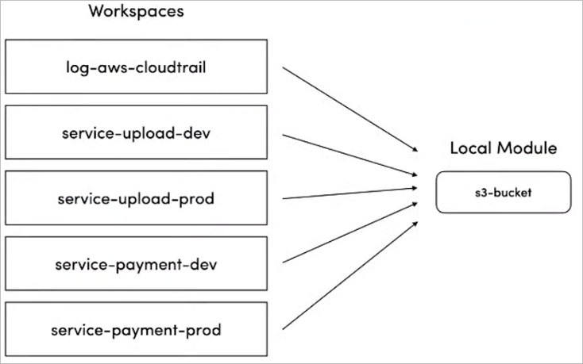
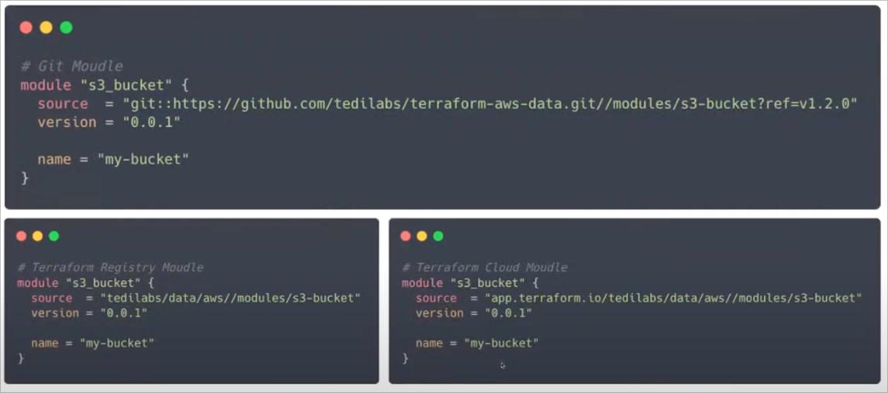
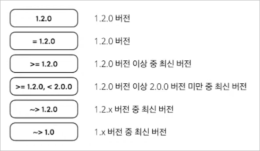

# 확장 가능한 테라폼 코드 관리

- 확장 가능한이란?
  - 가독성이 있는 코드
  - 유지보수가 쉬운 코드

## 테라폼 모듈을 사용하라

### 테라폼 모듈은 무엇인가?

- 모듈 (Module)
  - 여러 테라폼 리소스를 하나의 논리적 그룹으로 관리하기 위해 사용
  - 하나의 디렉토리 내에 .tf 혹은 .tf.json 파일로 구성된 콜렉션
- 루트 모듈 (Root Module)
  - 테라폼 CLI가 plan/apply 실제로 수행하게 되는 작업 디렉토리의 테라폼 코드 모음
- 차일드 모듈 (Child Module)
  - 다른 모듈의 테라폼 코드 내에서 호출(참조)하기 위한 목적으로 작성된 테라폼 코드 모음
  - 테라폼 문법에서 module 블록을 통해 호출하게 되는 테라폼 코드

### 테라폼 모듈을 사용해야 하는 이유: 중첩 루프 (Nested Loop)

- aws_iam_user_group_membership
- aws_iam_user
- aws_iam_user_policy_attachment
- 리소스 간의 관계
  - aws_iam_user_group_membership 0..1 — 1 aws_iam_user 1 — 0..n aws_iam_user_policy_attachment

### 테라폼 모듈을 사용해야 하는 이유: 캡슐화 (Encapsulation)

- 캡슐화 (Encapsulation)
  - 객체지향 프로그램의 핵심 개념 중 하나
  - 객체의 응집도와 독립성을 높이기 위해 객체의 모듈화를 지향하는 것

## 외부 모듈을 사용하지 마라

### 테라폼 레지스트리 (Terraform Registry)

- 하시코프에서 공식적으로 운영하는 테라폼 프로바이더 및 모듈 저장소
- 공개된 테라폼 모듈을 쉽게 찾아 활용할 수 있음

### GitHub: terraform-aws-modules

- 가장 많은 인기가 있는 테라폼 모듈

### 문제점

- 모듈에 심각한 보안 문제점을 찾아 당장 고쳐야 한다면?
- AWS 프로바이더 신규 버전에서 추가된 기능을 적용하고 싶은데, 모듈 내에 추상화 되어 건들 수가 없다면?
- 리소스에서는 지원해주는 기능인데, 모듈에서 해당 기능에 대한 인터페이스를 제공해주지 않고 있다면?

### 해결책

- DIY (Do It Your Self)
  - 조직 내에서 직접 테라폼 모듈을 설계하고 작성하여 관리
- Use After Fork
  - 외부 모듈을 사용하고자 한다면 조직 내부에 복제 후 사용

## 모듈의 버전을 관리하라

### 로컬 모듈

- 로컬 경로를 사용하면 버전을 선택할 수 없음
- 문제점
  

### 원격 모듈

### 버전 제약 조건 (Version Constraint)

