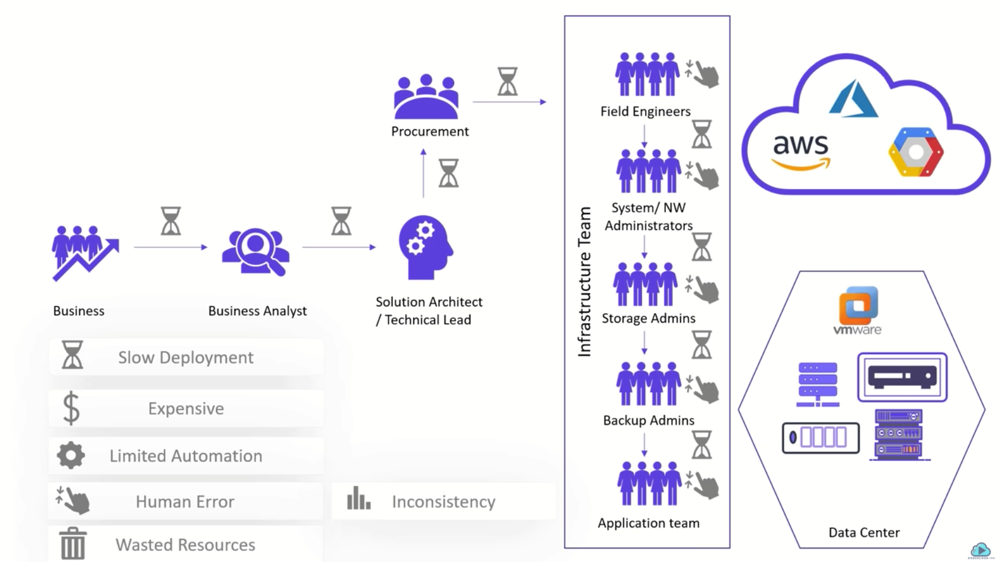
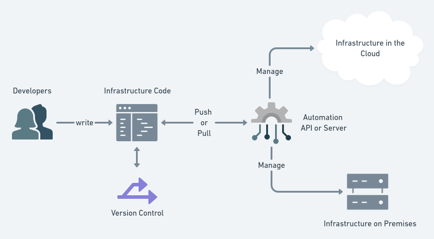

### 종래의 비즈니스 구조와 IaC의 등장배경

1. 비즈니스가 탄생
2. 비즈니스의 요구사항을 분석
3. 솔루션 아키텍트 or 테크니컬 리더가 사양을 분석하고, 인프라를 구상함
   - 프론트엔드, 백엔드의 서버 대수
   - 어떤 기술 스택을 사용할지
4. 구상된 인프라는 조달팀에 전달됨
5. 조달팀에서는 각각의 하드웨어에 적합한 벤더에게 연락을 취하고 인프라를 조달받음
   - 이 과정에서 몇일~몇달까지의 기간이 소요됨
   - 벤더로부터 데이터센터에 인프라(하드웨어)가 납품됨
6. 현장 엔지니어들이 투입되어 초기설정을 수행함
   - 시스템, 네트워크 엔지니어들이 먼저 각각 설정을 수행
   - 스토리지, 백업 엔지니어들이 작업을 수행
7. 상기 모든 과정이 종료된 이후에 비로소 어플리케이션 엔지니어들이 작업을 시작할 수 있음

- 이러한 비즈니스 모델은 여전히 유효하게 활용되고 있지만, 온프레미스 환경이기 때문에 각각의 단계별로 수행기간에 딜레이가 발생할수 있다는점은 디메리트로 작용하고 있음

##### 인프라를 코드로 관리하는 기술이 등장한 배경

- AWS, Azure, GCP로 대두되는 퍼블릭 클라우드가 등장하면서, API를 통해서 인프라를 프로비전할수 있게 됨
- API를 활용할수 있는 백엔드 엔지니어들이 인프라를 직접 구성하게 되면서, DevOps라는 새로운 문화가 생기기 시작함
- 각 퍼블릭 클라우드 벤더들은 각자의 클라우드 환경을 구축할 수 있는 자동화 툴(AWS: CloudFormation 등)을 제공하며 IaC를 활용할수 있도록 환경을 제공하기 시작
