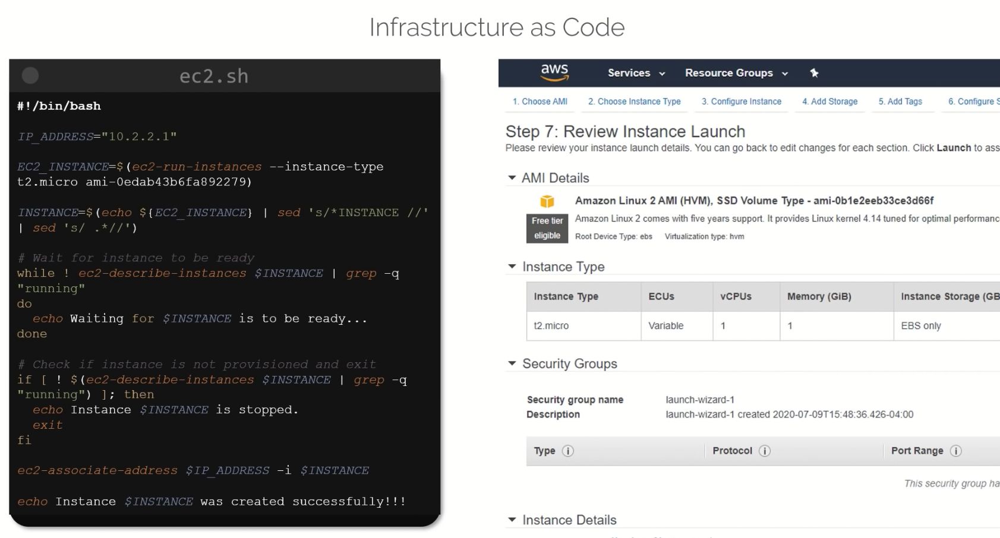
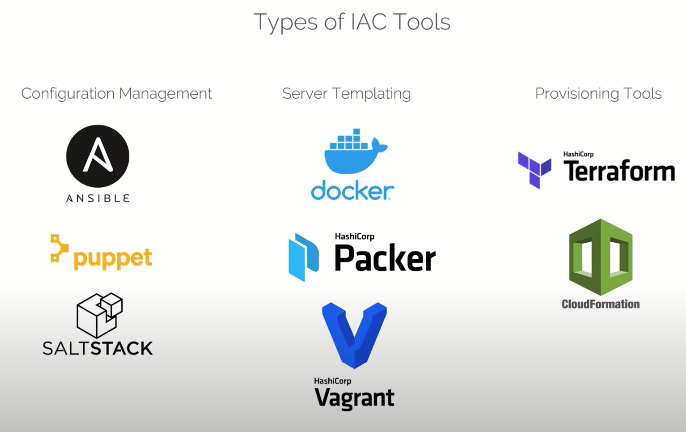
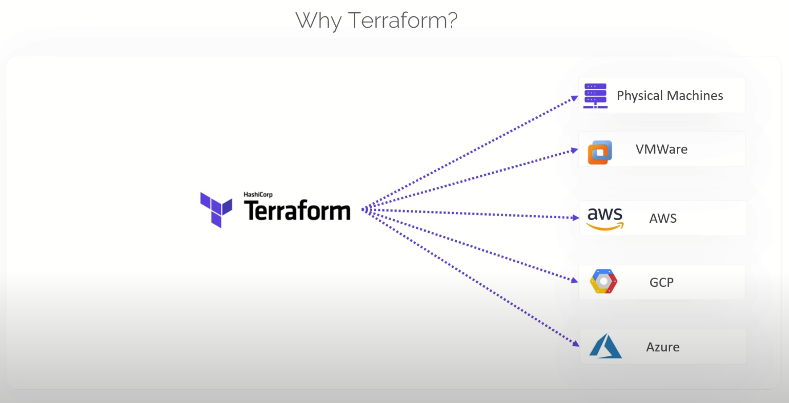

- 퍼블릭 클라우드 제공자들은 각각 인프라를 설정할수 있는 콘솔을 제공하는데, 이를 대체하여 요구에 맞는 인프라를 코드로 정의하고 활용하는것을 의미함

1. 설정 관리
   - 앤서블, 퍼펫, 솔트스택
   - 소프트웨어를 설치하고 관리하는데 특화되어 있음
   - 버전 관리가 가능
   - 멱등성을 제공함
     - 멱등성이란, 동일한 요청을 한번 보내는것과 여러번 보내는것이 같은 효과를 지니는것
     - ansible에서의 멱등성이란, ansible 툴을 여러번 사용하더라도 동일한 결과값을 보장해야 함을 의미
     - 좀더 자세히 예를 들면, 파일이나 디렉토리를 생성하는 create와 같은 ansible 모듈을 실행할때 반드시 when 조건절을 이용하는 것 등을 말함
2. 서버 템플레이팅
   - 도커, 패커, 베이그런트
   - 소프트웨어와 종속성 파일들을 미리 설치하는 용도
   - 가상머신 or 도커 이미지
   - 인프라의 불변성을 제공
3. 프로비저닝 툴
   - 테라폼
   - AWS 클라우드 포메이션

### Why Terraform?

- 테라폼은 다양한 프로바이더와 연계하고 있기 때문에, 테라폼 코드를 통해 다양한 인프라 환경을 하나의 툴로 관리 가능하도록 편의를 제공함
- 공식 퍼블릭 클라우드 프로바이더외에도 다양한 유저 프로바이더들이 존재함
  - BigIP, CloudFlare, DNS, Palo Alto, Infoblox, DataDog, Grafana, Auth0 ...
