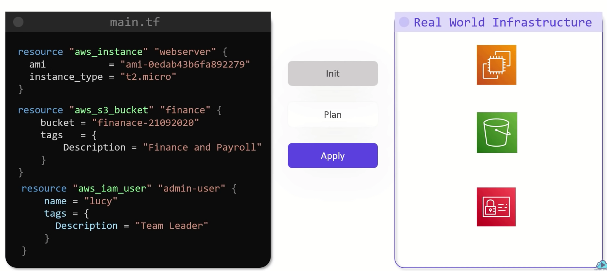

- 테라폼은 다양한 프로바이더와 연계하고 있기 때문에, 테라폼 코드를 통해 다양한 인프라 환경을 하나의 툴로 관리 가능하도록 편의를 제공함
- 공식 퍼블릭 클라우드 프로바이더외에도 다양한 유저 프로바이더들이 존재함
  - BigIP, CloudFlare, DNS, Palo Alto, Infoblox, DataDog, Grafana, Auth0 ...

### HashiCorp Configuration Language

- .tf 파일에 정리되는 리소스 정의 언어
- 3가지 페이즈로 구성되어 있음
  - Init
  - Plan
  - Apply
- 테라폼에서 모든 것들은 리소스로 정의됨
- Terraform Import를 통해서 다른 리소스를 테라폼 코드로 불러들일수 있음

### Installing Terraform

[Install Terraform | Terraform - HashiCorp Learn](https://learn.hashicorp.com/tutorials/terraform/install-cli)

- 테라폼은 다양한 버전의 OS를 지원하며, 공식으로 지원하는 것은 다음과 같음
  - macOS (64-bit)
  - FreeBSD (32-bit, 64-bit, Arm)
  - Linux (32-bit, 64-bit, Arm)
  - OpenBSD(32-bit, 64-bit)
  - Solaris (64-bit)
  - Windows (32-bit, 64-bit)
- HCL - Declarative Language (리소스를 정의하는 언어)
  - Resource (리소스: 파일이나 클라우드에서의 S3, EC2 기타 정의되는 자원 어떤것도 가능)
